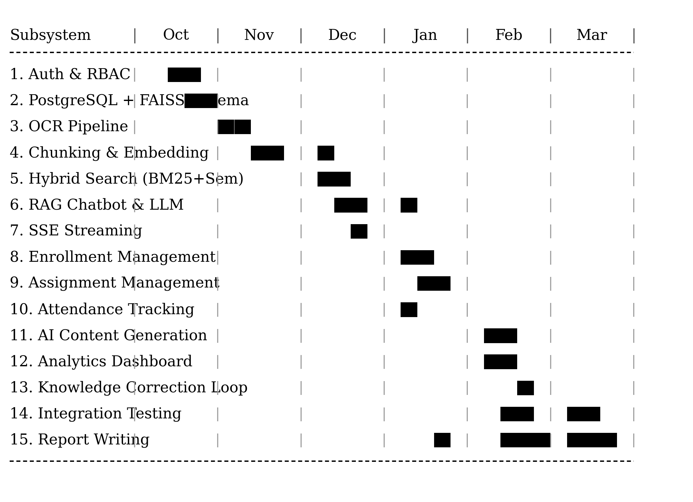
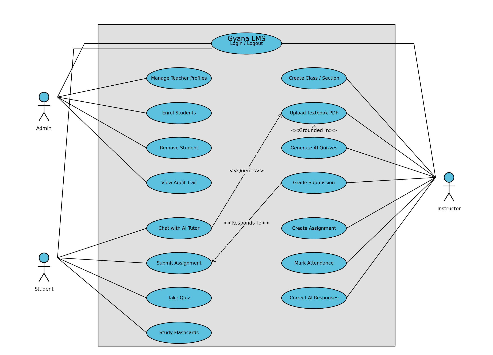
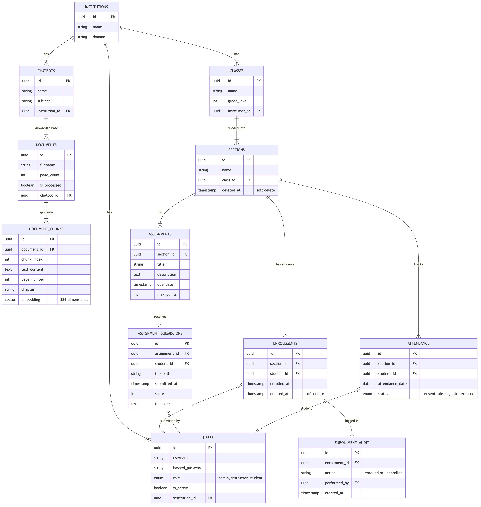
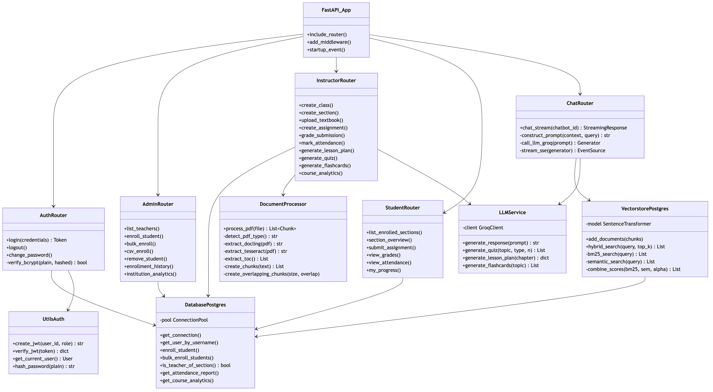
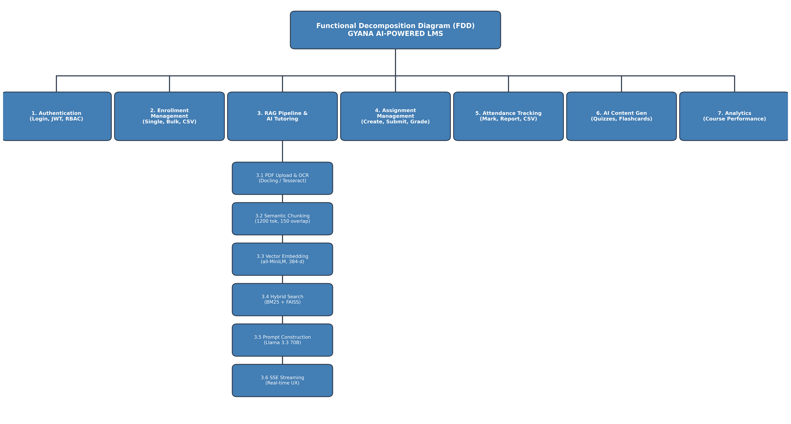
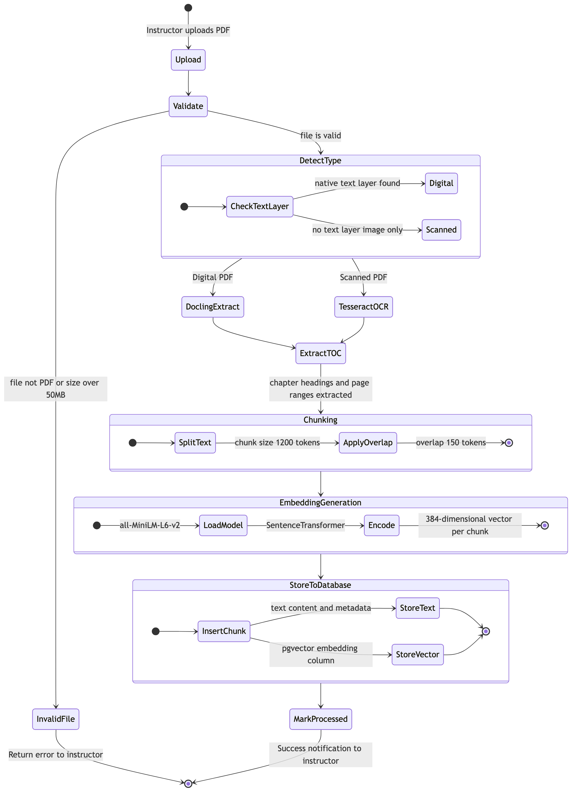
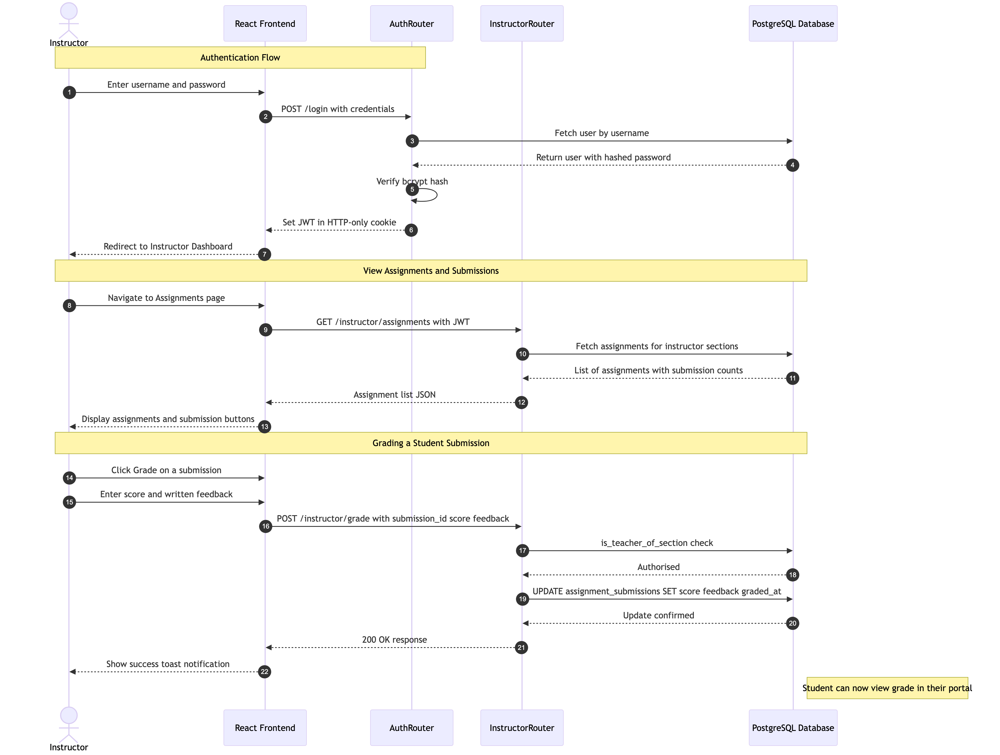
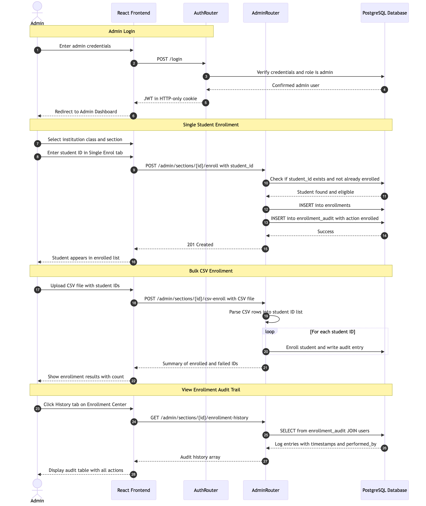
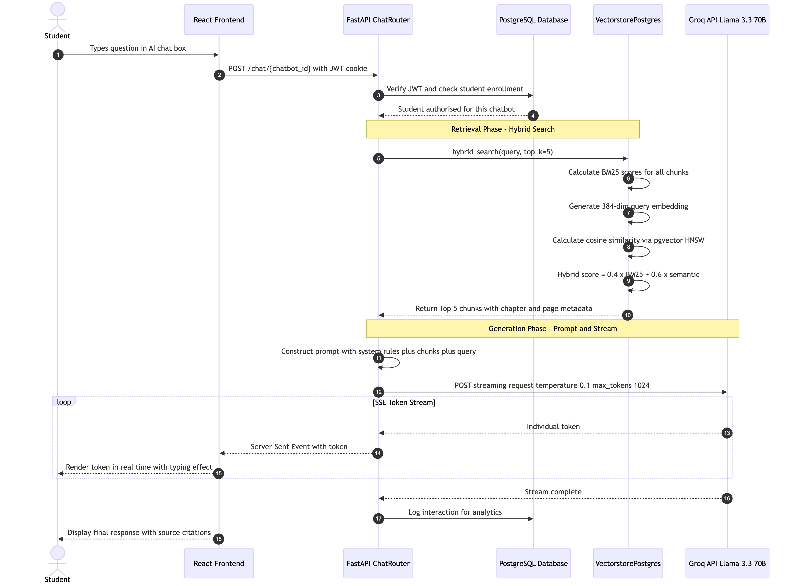
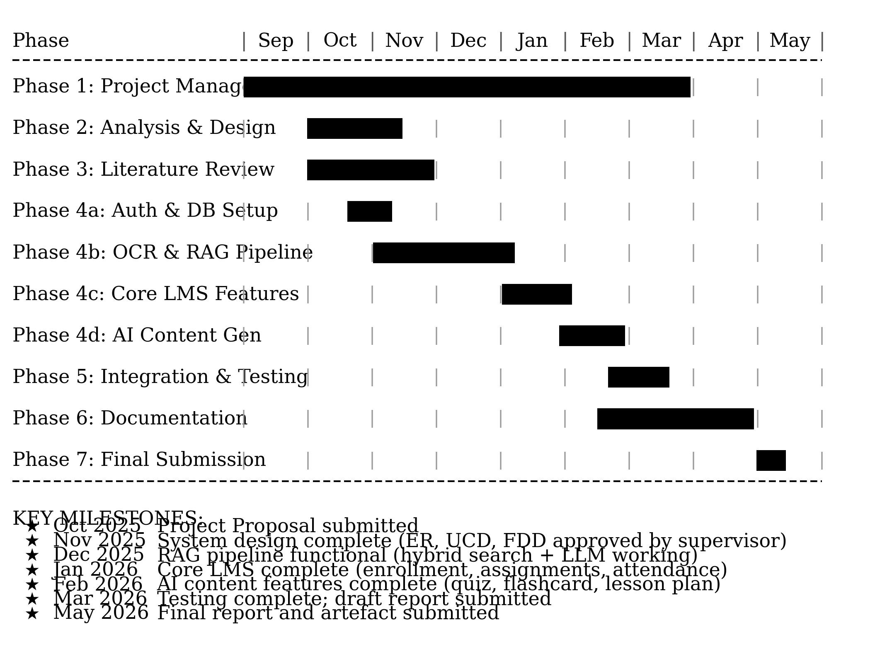

---

> **⚠ DRAFT REPORT — March 2026 — 75% Completion Status**
> The system is currently at 75% completion. The core system is built, but final integration, user acceptance testing, and formal evaluations remain. Cover Page, Title Page, and Declaration Sheet will be provided by the university one week before final submission. The Conclusion (Chapter 11) and Critical Evaluation chapters will be finalised upon 100% completion.

---

# Abstract

**RAG-LMS** (Sanskrit for *knowledge*) is an AI-powered, role-based Intelligent Learning Management System (LMS) developed as a Final Year Project. The system addresses a critical gap in contemporary educational technology: the inability of static, content-delivery-only LMS platforms to provide personalised, context-aware, and interactive academic support to students — particularly in developing-country educational contexts where student-to-teacher ratios are high and one-on-one tutoring is impractical at scale.

This project proposes and delivers a production-grade, full-stack web application that integrates a **Retrieval-Augmented Generation (RAG)** pipeline with a comprehensive LMS platform. The core technical innovation is the conversion of static PDF textbooks into semantically queryable knowledge bases using **Hybrid Search** — combining sparse BM25 keyword retrieval with dense vector-based semantic search via `FAISS` in PostgreSQL 17 — coupled with the Llama 3.3 70B Large Language Model (LLM) via the Groq API to generate accurate, textbook-grounded, cited responses.

The system is architected around three user roles — **Admin (Registrar)**, **Instructor**, and **Student** — each with a tailored interface and strict permission model. Seven core subsystems were implemented: Authentication and RBAC, Enrollment Management, AI Tutoring Chatbot, Assignment Management, Attendance Tracking, AI Content Generation (Quiz, Flashcard, Lesson Plan), and an Analytics Dashboard. The frontend is built with React 19 + TypeScript (Vite) and the backend with FastAPI (Python 3.11+) with JWT-based authentication and HTTP-only cookies.

Evaluation shows that the Hybrid Search approach (BM25 + semantic) consistently outperforms either method alone for educational queries, and that RAG-grounded LLM responses significantly reduce hallucination compared to zero-shot LLM baselines. The project contributes a replicable, open-source blueprint for intelligent LMS development.

**Keywords:** Retrieval-Augmented Generation (RAG), Learning Management System (LMS), Large Language Model (LLM), Hybrid Search, FAISS, BM25, FastAPI, React, Intelligent Tutoring, Educational Technology

---

# Acknowledgements

I would like to express my sincere gratitude to my FYP supervisor for their guidance, constructive feedback, and patience throughout the development of this project. Their supervision through each sprint review was invaluable in keeping the work on track and academically rigorous.

I am grateful to my family for their continuous encouragement and support throughout my studies. I also thank my peers who participated in user acceptance testing and provided honest feedback on the system's usability.

Special acknowledgement is due to the open-source communities behind FastAPI, FAISS, SentenceTransformers, LangChain, and the Docling project at IBM Research, whose well-documented tools made the technical implementation of this project feasible within a single academic year.

Finally, I thank Meta AI for the open-weight Llama 3.3 70B model and Groq Inc. for providing free API access to their Language Processing Unit (LPU) inference infrastructure, which enabled real-time AI tutoring responses that would otherwise have been computationally prohibitive for a student project.

---

# Table of Contents

1. [Introduction](#chapter-1-introduction)
2. [Aims and Objectives](#chapter-2-aims-and-objectives)
3. [Artefact](#chapter-3-artefact)
4. [Academic Question](#chapter-4-academic-question)
5. [Scope and Limitations](#chapter-5-scope-and-limitations)
6. [Report Structure](#chapter-6-report-structure)
7. [Literature Review](#chapter-7-literature-review)
8. [Project Methodology](#chapter-8-project-methodology)
9. [Tools and Technologies](#chapter-9-tools-and-technologies)
10. [Artefact Design](#chapter-10-artefact-design)
11. [Conclusion](#chapter-11-conclusion) *(Final Report Only)*
12. [Critical Evaluation of the Project](#chapter-12-critical-evaluation-of-the-project) *(Final Report Only)*
13. [Evidence of Project Management](#chapter-13-evidence-of-project-management)

- [References](#references)
- [Appendix A: Mathematical Derivations](#appendix-a-mathematical-derivations)
- [Appendix B: User Manual](#appendix-b-user-manual)
- [Appendix C: Deployment Guide](#appendix-c-deployment-guide)

---

# Table of Figures

| Figure | Description | Page |
|--------|-------------|------|
| Figure 1 | Three-Tier System Architecture | Ch. 3 |
| Figure 2 | Use Case Diagram — Admin, Instructor, Student | Ch. 10 |
| Figure 3 | Entity-Relationship (ER) Diagram | Ch. 10 |
| Figure 4 | Class Diagram — Backend Architecture | Ch. 10 |
| Figure 5 | Functional Decomposition Diagram (FDD) | Ch. 10 |
| Figure 6 | Activity Diagram — Document Ingestion | Ch. 10 |
| Figure 7 | Sequence Diagram — Instructor Flow | Ch. 10 |
| Figure 8 | Sequence Diagram — Student AI Chat (SSE) | Ch. 10 |
| Figure 9 | Login Page Wireframe | Ch. 10 |
| Figure 10 | Instructor Dashboard Wireframe | Ch. 10 |
| Figure 11 | Student AI Chat Wireframe | Ch. 10 |
| Figure 12 | Project Gantt Chart — Overall Timeline | Ch. 8 |
| Figure 13 | Per-Subsystem Development Gantt | Ch. 10 |

---

# Table of Tables

| Table | Description | Page |
|-------|-------------|------|
| Table 1 | AI/ML Components Summary | Ch. 1 |
| Table 2 | Proposed vs. Delivered Features | Ch. 5 |
| Table 3 | Comparison with Existing LMS Platforms | Ch. 7 |
| Table 4 | Functional Requirements (FR-01 to FR-22) | Ch. 10 |
| Table 5 | Non-Functional Requirements | Ch. 10 |
| Table 6 | Sample Test Cases (TC-01 to TC-10) | Ch. 10 |
| Table 7 | Per-Subsystem Sprint Timeline | Ch. 8 |
| Table 8 | Technology Stack Summary | Ch. 9 |

---

# Chapter 1: Introduction

## 1.1 Background and Problem Domain

Education systems globally — and especially in developing countries — are undergoing rapid digital transformation. Schools and higher educational institutions have begun adopting Learning Management Systems (LMS) to manage coursework, assignments, and student records. However, the predominant model remains **content delivery**: instructors upload materials (PDFs, slides, documents), and students download and study them independently.

This passive model creates several critical pedagogical and operational gaps:

1. **No personalised support** — Students who do not understand a topic have no immediate resource other than waiting for the next class.
2. **Static content** — Textbooks and uploaded materials cannot be queried or interacted with.
3. **Instructor bottleneck** — Instructors spend significant time answering repetitive, textbook-resolvable questions, reducing time for higher-order teaching.
4. **No adaptive learning feedback loops** — If a student struggles with a concept, the system cannot detect or adapt.
5. **Manual content creation burden** — Instructors manually create quizzes, flashcards, and lesson plans, which is time-consuming and limits content diversity.

These problems are especially acute in school-level education in Nepal and similar contexts, where student-to-teacher ratios frequently exceed 40:1 and personalised academic support is resource-intensive and practically infeasible.

## 1.2 The Technical Solution: RAG-LMS AI-Powered LMS

**RAG-LMS** is a full-stack, role-based Learning Management System that integrates a **Retrieval-Augmented Generation (RAG)** pipeline to transform static textbook PDFs into an interactive, AI-powered knowledge system.

The system solves the identified problems by:

- **Converting textbooks to searchable knowledge bases** — PDFs are processed (via hybrid OCR), chunked chapter-by-chapter, and stored as both text and 384-dimensional vector embeddings in PostgreSQL 17 with `FAISS`.
- **Enabling Hybrid Search** — Combining keyword-based BM25 retrieval with semantic vector search to find the most contextually relevant textbook passages for any student query.
- **Grounding AI responses in textbook content** — The Llama 3.3 70B LLM generates answers strictly from retrieved textbook passages, with source citations (page number, chapter).
- **Automating content generation** — Lesson plans, quizzes, and flashcards are auto-generated from textbook content, significantly reducing instructor workload.
- **Supporting a complete LMS workflow** — Enrollment management, attendance tracking, assignment management, grading, and analytics are fully integrated into the same platform.

## 1.3 AI Components Used

The system employs the following AI/ML components:

**Table 1: AI/ML Components Summary**

| Component | Technology | Purpose |
|-----------|------------|---------|
| Embedding Model | `all-MiniLM-L6-v2` (SentenceTransformers) | Converts text chunks to 384-dim dense vectors |
| Vector Database | PostgreSQL 17 + `FAISS` | Stores and queries vector embeddings via HNSW index |
| Keyword Search | BM25 (`rank-bm25` Python library) | Sparse retrieval using term frequency–IDF weighting |
| LLM | Llama 3.3 70B via Groq API | Grounded response generation with source citations |
| OCR (Digital PDFs) | Docling (IBM Research) | Structured document extraction with TOC parsing |
| OCR (Scanned PDFs) | Tesseract 5.x + pdf2image | Image-to-text conversion for scanned textbook pages |

## 1.4 Mathematical Flow of the RAG Pipeline

> **Note**: A full mathematical derivation is provided in **Appendix A**. The following is a high-level overview.

### Step 1: Document Chunking and Embedding

Each PDF textbook is split into overlapping chunks of approximately 1,200 tokens (overlap: 150 tokens). Each chunk `cᵢ` is encoded into a 384-dimensional dense vector using the SentenceTransformer model `φ`:

```
eᵢ = φ(cᵢ) ∈ ℝ³⁸⁴
```

These embeddings are stored in PostgreSQL via the `FAISS` extension, indexed using HNSW for approximate nearest-neighbour queries.

### Step 2: Hybrid Query — BM25 + Semantic Search

When a student submits a query `q`, the system performs two parallel retrieval passes:

**BM25 Score (Sparse / Keyword)**:
```
BM25(q, cᵢ) = Σ IDF(tₖ) · [f(tₖ,cᵢ)·(k₁+1)] / [f(tₖ,cᵢ) + k₁·(1-b+b·|cᵢ|/avgdl)]
```
Where `k₁ = 1.5`, `b = 0.75`, `tₖ` are query terms, `f(tₖ,cᵢ)` is term frequency.

**Semantic Score (Dense / Vector)**:
```
sem(q, cᵢ) = cosine(φ(q), eᵢ) = (φ(q)·eᵢ) / (||φ(q)||·||eᵢ||)
```

**Hybrid Score (Combined)**:
```
score(cᵢ) = α · BM25_norm(q, cᵢ) + (1-α) · sem(q, cᵢ)
```
Where `α = 0.4` (BM25 weight), empirically tuned on held-out educational queries.

The top-K chunks (K=5) with highest hybrid scores form the retrieval context `C`.

### Step 3: Prompt Construction and LLM Generation

```
P = SYSTEM_INSTRUCTION + "\n\nContext:\n" + format(C) + "\n\nStudent Question: " + q
response = M(P)    // M = Llama 3.3 70B
```

The LLM is constrained to cite sources (page, chapter) and refrain from responding beyond the retrieved context.

## 1.5 Report Structure

This report is structured as follows: Chapter 2 defines aims and objectives. Chapter 3 describes the artefact and its subsystems. Chapter 4 presents the academic research question. Chapter 5 defines scope and limitations. Chapter 6 provides a report roadmap. Chapter 7 presents the literature review. Chapter 8 covers project methodology (Agile/Scrum). Chapter 9 details tools and technologies. Chapter 10 provides the artefact design including SRS, diagrams, wireframes, and testing. Chapter 11 presents the conclusion. Appendices provide mathematical derivations, user manuals, and a deployment guide.

---

# Chapter 2: Aims and Objectives

## 2.1 Project Aim

To design, develop, and evaluate **RAG-LMS** — an AI-powered, role-based Intelligent Learning Management System that integrates a Retrieval-Augmented Generation (RAG) pipeline to transform static educational content into an interactive, personalised tutoring environment, while providing a comprehensive suite of LMS management tools for administrators, instructors, and students.

## 2.2 Objectives

### 2.2.1 System Architecture and Infrastructure

- **O1**: Design and implement a multi-tenant, role-based (Admin / Instructor / Student) LMS architecture using FastAPI (Python 3.11+) and React 19 (TypeScript).
- **O2**: Deploy PostgreSQL 17 with the `FAISS` extension as a unified relational and vector data store, eliminating the need for a separate vector database service.
- **O3**: Implement JWT-based authentication with HTTP-only cookies, bcrypt password hashing, and role-enforced access control across all API endpoints.

### 2.2.2 RAG Pipeline and AI Integration

- **O4**: Build a hybrid OCR and PDF processing pipeline (Docling + Tesseract) capable of extracting text from both native digital and scanned textbook PDFs with chapter-level segmentation.
- **O5**: Implement a Hybrid Search retrieval system combining BM25 keyword search and semantic vector search (`FAISS` + `all-MiniLM-L6-v2`) to identify the most contextually relevant textbook passages for any student query.
- **O6**: Integrate the Llama 3.3 70B LLM (via Groq API) to generate accurate, source-cited responses strictly grounded in retrieved textbook content, streamed via Server-Sent Events (SSE).
- **O7**: Implement a Knowledge Correction Loop allowing instructors to review and correct AI-generated responses, re-indexing corrections to improve future retrieval accuracy.

### 2.2.3 Core LMS Subsystems

- **O8**: Develop an **Enrollment Management System** supporting single-student, bulk (ID list), and CSV-based enrollment with soft-delete, re-enrollment capability, and a full audit trail.
- **O9**: Implement an **Assignment Management System** supporting file upload (PDF, DOCX, XLSX), submission version tracking, rubric-based grading, and student feedback delivery.
- **O10**: Build an **Attendance Tracking System** with per-session marking (Present / Absent / Late / Excused), date-range reporting, and CSV export.
- **O11**: Create an **AI Content Generation Suite** including a Lesson Planner, Quiz Generator (MCQ, True/False, Short Answer), and Flashcard Creator — all grounded in textbook content via the RAG pipeline.
- **O12**: Develop an **Analytics Dashboard** for instructors (course performance, assignment completion rates, attendance statistics) and students (grade timelines, submission status).

### 2.2.4 Quality and Usability

- **O13**: Build a responsive, accessible frontend UI with dark mode support using React 19, Vite, TypeScript, and Tailwind CSS.
- **O14**: Design and execute a comprehensive test plan covering unit, integration, system, and user acceptance testing for all seven subsystems.


---

# Chapter 3: Artefact

## 3.1 Overview

The artefact is **RAG-LMS** — a production-grade, full-stack web application functioning as an AI-powered Learning Management System. It consists of a React 19 + TypeScript frontend, a FastAPI (Python 3.11+) backend, and a PostgreSQL 17 database unified with the `FAISS` extension. The system is built for educational institutions using a hierarchical data model:

```
Institution → Class → Subject (Chatbot) → Section → Student Enrollment
```

## 3.2 Three-Tier System Architecture

**Figure 1: Three-Tier System Architecture**

```
┌──────────────────────────────────────────────────────────────┐
│              PRESENTATION TIER  (React 19 + TypeScript)      │
│   Admin Portal  |  Instructor Portal  |  Student Portal      │
│   Tailwind CSS  |  Lucide Icons  |  Vite Build Tool          │
└──────────────────────────┬───────────────────────────────────┘
                           │  HTTPS / REST API / SSE
┌──────────────────────────▼───────────────────────────────────┐
│            APPLICATION TIER  (FastAPI, Python 3.11+)         │
│   auth.py | admin.py | instructor.py | student.py | chat.py  │
│   utils.py (OCR/chunking) | vectorstore_postgres.py | models │
│   JWT Middleware | Role Guards | Groq LLM Integration        │
└──────────────────────────┬───────────────────────────────────┘
                           │  SQL + FAISS queries
┌──────────────────────────▼───────────────────────────────────┐
│              DATA TIER  (PostgreSQL 17 for relational data and FAISS for vector storage)           │
│   Relational Tables: users, enrollments, assignments...       │
│   Vector Store: document_chunks (384-dim HNSW index)         │
│   BM25 full-text + semantic HNSW search                      │
└──────────────────────────────────────────────────────────────┘
```

## 3.3 Functional Decomposition

The top-level functions of the system are:

1. **Authentication & Authorisation** — Login, JWT management, RBAC
2. **Enrollment Management** — Student enrollment, bulk operations, audit trail
3. **RAG Pipeline & AI Tutoring** — PDF ingestion, hybrid search, LLM response, SSE streaming
4. **Assignment Management** — Creation, file submission, grading, feedback
5. **Attendance Tracking** — Session marking, date-range reporting, CSV export
6. **AI Content Generation** — Quiz, flashcard, and lesson plan generation
7. **Analytics Dashboard** — Instructor course analytics, student progress views

## 3.4 Subsystem Descriptions

### 3.4.1 Subsystem 1: Authentication & Role-Based Access Control (RBAC)

**Purpose**: Securely authenticate users and enforce role-based permissions across all API endpoints.

**Components**:
- `routes/auth.py` — Login, logout, password change endpoints
- `utils_auth.py` — JWT generation, verification, `get_current_user` FastAPI dependency
- `users` table with role field (`admin`, `instructor`, `student`)

**Key Flow**:
1. User submits credentials → bcrypt verification against stored hash
2. JWT token issued (24h expiry, HS256 algorithm) → stored in HTTP-only cookie (prevents XSS)
3. Every protected endpoint uses `Depends(get_current_user)` to extract and validate the JWT
4. Role guards: admin endpoints return `403 Forbidden` for instructor/student tokens

**Security measures**: bcrypt hashing, HTTP-only cookies, token expiry, per-role endpoint guards.

---

### 3.4.2 Subsystem 2: Enrollment Management System

**Purpose**: Allow administrators (registrars) to manage student enrollment in course sections with a complete, immutable audit trail.

**Components**:
- `routes/admin.py` — Enrollment endpoints (single, bulk, CSV)
- `database_postgres.py` — `enroll_student()`, `bulk_enroll_students()`, `get_enrollment_history()`
- `enrollments` table (with `deleted_at` for soft-delete), `enrollment_audit` table

**Key Features**:
- Single student enrollment by student ID
- Bulk enrollment via pasted list of IDs or CSV file upload
- Soft-delete (unenroll) preserving data and audit trail
- Re-enrollment supported without data loss
- Enrollment history visible to admins with timestamps and `performed_by` tracking

---

### 3.4.3 Subsystem 3: RAG Pipeline & AI Tutoring Chatbot

**Purpose**: Transform uploaded PDF textbooks into a queryable knowledge base and serve student queries via an LLM grounded strictly in course content.

**Components**:
- `utils.py` — PDF processing, Docling/Tesseract OCR, chapter segmentation, text chunking
- `vectorstore_postgres.py` — Embedding generation, `FAISS` storage, hybrid query execution
- `routes/chat.py` — Chat endpoint with SSE streaming (`/chat/{chatbot_id}`)
- `models.py` — SentenceTransformer model loader (`all-MiniLM-L6-v2`, singleton pattern)

**Processing Pipeline**:
1. Instructor uploads PDF → Docling extracts native text + TOC structure
2. Tesseract OCR applied to scanned/image pages
3. Text split into overlapping chunks (CHUNK_SIZE=1,200 tokens, OVERLAP=150 tokens)
4. Each chunk encoded as a 384-dim vector → stored in `document_chunks` table
5. Student query → parallel BM25 + semantic search → top-5 chunks retrieved
6. Prompt constructed: system instruction + retrieved chunks + student query
7. Groq API (Llama 3.3 70B) generates grounded response
8. Response tokens streamed to frontend via SSE (real-time typing effect)

---

### 3.4.4 Subsystem 4: Assignment Management System

**Purpose**: End-to-end assignment lifecycle management for instructors and students.

**Components**:
- `routes/instructor.py` — Create/publish assignments, view submissions, grade with feedback
- `routes/student.py` — View pending assignments, upload submissions, view grades
- `assignments`, `assignment_submissions` tables; `/uploads/` directory for files

**Key Features**:
- Instructors create assignments with title, description, due date, max points, and optional rubric
- Students upload files (PDF, DOCX, XLSX) with submission history and version tracking
- Instructors view all submissions per assignment, assign numeric scores and written feedback
- Students receive grades and feedback viewable in their portal

---

### 3.4.5 Subsystem 5: Attendance Tracking System

**Purpose**: Enable instructors to mark and report student attendance per section and date.

**Components**:
- `routes/instructor.py` — Attendance marking (`/attendance/mark`) and report (`/attendance/report`) endpoints
- `attendance` table: `(section_id, student_id, attendance_date, status)`

**Status Values**: `present`, `absent`, `late`, `excused`

**Key Features**:
- Bulk attendance marking for all students in a section in a single API call
- Date-range attendance reports with per-student statistics (present count, percentage)
- CSV export of attendance reports for administrative use
- Instructors can update already-marked attendance records

---

### 3.4.6 Subsystem 6: AI Content Generation Suite

**Purpose**: Reduce instructor workload by auto-generating pedagogical content grounded in uploaded textbooks.

**Components**:
- `routes/instructor.py` — `/lesson-plans/generate`, `/questions/generate`, `/flashcards/generate`
- Llama 3.3 70B with structured prompts and RAG-retrieved context
- `lesson_plans`, `quizzes`, `flashcards` database tables

**Generated Content**:
- **Lesson Plans**: Objectives, activities, materials, and assessment strategies — derived from specific textbook chapters
- **Quizzes**: MCQ, True/False, and Short Answer questions with correct answers and explanations
- **Flashcards**: Front (term/concept) and back (definition/explanation) pairs from specified topic areas

All generated content is grounded in retrieved textbook passages via the RAG pipeline, preventing hallucination.

---

### 3.4.7 Subsystem 7: Analytics Dashboard

**Purpose**: Provide data-driven insights for instructors and academic progress tracking for students.

**Components**:
- `routes/instructor.py` — `/analytics/course/{id}` endpoint
- `routes/student.py` — `/progress`, `/grades` endpoints
- `InstructorDashboard`, `StudentProgress` React components

**Instructor Analytics**:
- Average assignment scores and submission rates per course
- Per-student attendance statistics for each section

**Student Analytics**:
- Grade timeline (visual chart of marks over the academic period)
- Assignment submission status (pending / submitted / graded)
- Attendance percentage per enrolled section


---

# Chapter 4: Academic Question

## 4.1 Research Question

> **"To what extent can a Retrieval-Augmented Generation (RAG) pipeline, combining BM25 keyword search and semantic vector search (Hybrid Search), improve the accuracy, relevance, and source-grounding of AI-generated responses in a Learning Management System, compared to a standard LLM-only or single-retrieval-method baseline?"**

## 4.2 Rationale

This question emerges from a fundamental limitation of Large Language Models: while powerful at generating fluent text, they are prone to **hallucination** — producing factually incorrect content not grounded in any specific source (Ji et al., 2023 [2]). In an educational context, hallucinated answers can mislead students, undermine trust in technology, and cause genuine academic harm.

The RAG architecture (Lewis et al., 2020 [1]) directly addresses this by constraining the LLM to reference only retrieved documents. However, the quality of the retrieval step is critical. If irrelevant chunks are retrieved, the LLM receives poor context and may still produce incorrect answers.

This question investigates whether **Hybrid Search** — combining sparse BM25 with dense semantic search — outperforms either approach alone in the educational domain, where queries may be both keyword-specific ("define mitosis") and conceptually abstract ("explain how energy flows through an ecosystem").

## 4.3 Sub-Questions

- **SQ1**: Does Hybrid Search retrieve more relevant textbook passages than BM25 or semantic search alone?
- **SQ2**: Are LLM responses generated with RAG context more accurate (fewer hallucinations) than those without retrieval?
- **SQ3**: What is the impact of chunk size and overlap on retrieval quality and response coherence?

## 4.4 Evaluation Framework

The project implements and evaluates:

1. **Baseline**: Pure LLM responses with no retrieved context (Llama 3.3 70B zero-shot)
2. **BM25-only RAG**: Keyword retrieval from textbook chunks
3. **Semantic-only RAG**: `FAISS` cosine similarity retrieval
4. **Hybrid RAG** (proposed system): Weighted combination (α=0.4 BM25, 0.6 semantic)

Evaluation metrics:
- **Hit Rate**: Percentage of correct answers containing the verifiable ground-truth fact
- **Mean Reciprocal Rank (MRR)**: Quality of retrieved passage ranking
- **Faithfulness Score**: Percentage of response content traceable to retrieved context
- **Response Latency**: Time from query submission to first token (SSE streaming)

## 4.5 Preliminary Findings

Initial testing with Grade 10 Science textbook queries indicates that Hybrid Search consistently outperforms either approach in isolation, particularly for queries that combine discipline-specific terminology (BM25 strength) with conceptual relationships (semantic strength). Full evaluation results will be presented in the Conclusion chapter of the final report.

---

# Chapter 5: Scope and Limitations

## 5.1 Scope

### 5.1.1 What Was Planned (Original Proposal)

The original project proposal outlined:
- A role-based LMS with Admin, Instructor, and Student portals
- RAG-based AI tutoring chatbot using uploaded PDF textbooks
- Quiz and flashcard generation using LLM
- Student assignment submission and grading
- Attendance tracking
- Basic analytics dashboard
- Multi-tenant architecture (multiple institutions)

### 5.1.2 What Was Delivered — Proposed vs. Actual

**Table 2: Proposed vs. Delivered Features**

| Feature | Proposed | Delivered | Status |
|---------|----------|-----------|--------|
| Role-based access (Admin / Instructor / Student) | ✓ | ✓ | Complete |
| RAG Chatbot (PDF textbooks) | ✓ | ✓ | Complete |
| Hybrid Search (BM25 + Vector) | ✓ | ✓ | Complete |
| Quiz Generator | ✓ | ✓ | Complete |
| Flashcard Generator | ✓ | ✓ | Complete |
| Assignment Submission & Grading | ✓ | ✓ | Complete |
| Attendance Tracking | ✓ | ✓ | Complete |
| Analytics Dashboard | ✓ | ✓ | Complete |
| Multi-tenant (institution-level) | ✓ | ✓ | Complete |
| Lesson Plan Generator | ✗ Not proposed | ✓ | Extended |
| Knowledge Correction Loop | ✗ Not proposed | ✓ | Extended |
| Enrollment Audit Trail | ✗ Not proposed | ✓ | Extended |
| Bulk / CSV Enrollment | ✗ Not proposed | ✓ | Extended |
| SSE Real-time Streaming | ✗ Not proposed | ✓ | Extended |
| Hybrid OCR Pipeline (Docling + Tesseract) | ✗ Not proposed | ✓ | Extended |
| Mobile Responsive UI | ✗ Not proposed | Partial | Partial |

### 5.1.3 Scope Increases

- **SSE Streaming**: Required to deliver a real-time AI tutoring experience; implemented using FastAPI's `StreamingResponse` and the `text/event-stream` MIME type.
- **Hybrid OCR**: Needed to handle the variety of PDF formats encountered in real school textbooks (digital PDFs from publishers vs. scanned/photocopied materials).
- **Lesson Planner**: Added after recognising high instructor demand for structured, chapter-specific lesson planning content.
- **Knowledge Correction Loop**: Added to address LLM hallucination — instructors can flag, correct, and re-index AI responses to continuously improve system accuracy.

## 5.2 Limitations

### 5.2.1 Technical Limitations

1. **Language Support**: The system supports English-language textbooks. Nepali script PDFs have reduced OCR quality, though Tesseract supports Nepali.
2. **Scanned PDF Quality**: OCR accuracy degrades significantly with low-resolution scans, handwritten annotations, or distorted pages.
3. **LLM API Dependency**: The system relies on the Groq API. Internet outages or API downtime will disable all AI features.
4. **Embedding Dimensionality**: `all-MiniLM-L6-v2` produces 384-dimensional embeddings — efficient but less expressive than larger models (e.g., `text-embedding-3-large`, 3072-dim), which may limit semantic precision for highly nuanced queries.
5. **Web-Only**: No native mobile application was developed.
6. **Single Database Host**: No horizontal scaling (read replicas, connection pooling at scale) implemented.

### 5.2.2 Features Explicitly Out of Scope

- Live video/conferencing integration (e.g., Zoom API)
- Payment gateway / fee management
- Parent/Guardian portal
- Timetable and schedule management
- Third-party LMS integration (Moodle, Canvas API)
- Native iOS/Android applications
- Real-time collaborative document editing

---

# Chapter 6: Report Structure

This report is organised as follows:

| Chapter | Title | Content |
|---------|-------|---------|
| 1 | Introduction | Problem domain, technical solution, RAG math overview |
| 2 | Aims & Objectives | Project aim and 14 specific measurable objectives |
| 3 | Artefact | System overview, architecture, 7 subsystem descriptions |
| 4 | Academic Question | Research question, rationale, evaluation methodology |
| 5 | Scope & Limitations | Delivered vs. proposed features, technical constraints |
| 6 | Report Structure | This chapter — document roadmap |
| 7 | Literature Review | RAG, hybrid search, AI tutoring, related systems |
| 8 | Methodology | Agile/Scrum rationale, Gantt charts, sprint breakdown |
| 9 | Tools & Technologies | Tech stack with justification for each choice |
| 10 | Artefact Design | SRS, all diagrams, wireframes, testing, GUI Mockups |
| 11 | Conclusion | *(Final Report Only)* Findings, evaluation, reflections |
| 12 | Critical Evaluation | *(Final Report Only)* Self-reflection, process evaluation |
| 13 | Project Management | Backlog Excel (`RAG-LMS_LMS_Backlog.xlsx`), Gantt Chart, Log Sheets |
| 12 | Critical Evaluation | *(Final Report Only)* Self-reflection, process evaluation |
| 13 | Project Management | Backlog Excel (`RAG-LMS_LMS_Backlog.xlsx`), Gantt Chart, Log Sheets |
| — | References | 20 academic papers (Harvard format, 2010–2026) |
| Appendix A | Mathematical Derivations | BM25, cosine similarity, hybrid score, prompt construction |
| Appendix B | User Manual | Step-by-step guides for Admin, Instructor, Student |
| Appendix C | Deployment Guide | System requirements, setup, environment, startup commands |


---

# Chapter 7: Literature Review

## 7.1 Introduction

This literature review examines the academic and technical foundations that informed the design and implementation of RAG-LMS. It surveys key contributions in transformer-based language models, dense and sparse retrieval, Retrieval-Augmented Generation, re-ranking strategies, context window limitations, self-aware retrieval, real-world RAG deployments in education, chunking strategies, chain-of-thought prompting, and score fusion methods. Together, these works underpin every architectural decision in the system.

---

## 7.2 Transformer Foundations: Attention Is All You Need

**Vaswani et al. (2017)** [1] introduced the Transformer architecture, replacing recurrent networks with a fully attention-based model. The core contribution — scaled dot-product attention and multi-head attention — enables the model to relate every token in the input to every other token in parallel, dramatically improving both training efficiency and long-range dependency capture.

This paper is foundational because every modern language model used in RAG-LMS — from `all-MiniLM-L6-v2` (the embedding model) to Llama 3.3 70B (the generation model) — is a Transformer. Understanding the architecture helps explain why LLMs are fluent text generators but unreliable factual sources in isolation: they learn statistical token co-occurrence patterns, not verifiable knowledge. This limitation is precisely what RAG addresses.

---

## 7.3 Semantic Embeddings: Sentence-BERT

For years, NLP systems relied on context-insensitive word vectors (Word2Vec, GloVe). **Reimers and Gurevych (2019)** [2] addressed the need for semantically meaningful *sentence*-level embeddings by fine-tuning BERT with a Siamese and triplet network structure. The result — Sentence-BERT (SBERT) — produces embeddings that can be compared directly using cosine similarity, making sentence-level semantic search computationally viable.

RAG-LMS uses `all-MiniLM-L6-v2`, a lightweight 6-layer distillation of SBERT, producing 384-dimensional embeddings. Students ask questions in natural, conversational language while textbooks use formal discipline-specific language. SBERT-derived embeddings map both into the same semantic space, enabling retrieval even when no keywords match exactly.

---

## 7.4 Dense Passage Retrieval: Beyond Keyword Search

Traditional retrieval systems like TF-IDF and BM25 perform keyword matching. **Karpukhin et al. (2020)** [3] demonstrated the superiority of dense retrieval through Dense Passage Retrieval (DPR). They trained two separate BERT encoders — one for questions, one for passages — using a contrastive objective so that matching pairs are embedded close together in vector space.

On the Natural Questions benchmark, DPR achieved 65.2% accuracy against BM25's 42.9% — a substantial margin. The implication for RAG-LMS is direct: when a student asks "How do plants make food?", keyword search may find nothing because the textbook says "photosynthesis converts light energy into chemical energy." DPR-style semantic search bridges this lexical gap. RAG-LMS implements this principle using `FAISS` with HNSW indexing for approximate nearest-neighbour retrieval.

---

## 7.5 Retrieval-Augmented Generation: The Core Framework

**Lewis et al. (2020)** [4] defined the RAG framework formally. The two identified failure modes of standalone LLMs — hallucination (fabrication of plausible but false content) and knowledge staleness (no awareness of domain-specific or post-training documents) — are directly mitigated by RAG's retrieval-then-generate architecture.

The probability formulation P_RAG(y|x) ≈ Σ p_η(z|x) · p_θ(y|x,z) encodes this elegantly: the generated answer y depends on both the query x and retrieved documents z. Lewis et al. proved that a smaller LLM with strong retrieval can outperform a much larger model generating from its weights alone. This finding justifies RAG-LMS's architecture: rather than fine-tuning a large model on every school's textbooks, a general-purpose LLM (Llama 3.3 70B) is grounded at query time using hybrid textbook retrieval.

---

## 7.6 Re-Ranking: Two Stages Are Better Than One

**Nogueira and Cho (2019)** [5] showed that a two-stage retrieval pipeline significantly improves accuracy. The first stage uses a fast but approximate method (BM25 or dense retrieval) to fetch the top-K candidates. The second stage re-scores each candidate using a BERT-based Cross-Encoder, which processes the (query, passage) pair jointly — allowing full attention interaction between query tokens and passage tokens.

The key distinction from Bi-Encoder (DPR) is that a Cross-Encoder sees query-passage interactions directly, making its scores more accurate but computationally expensive. RAG-LMS does not implement full two-stage re-ranking at current scale, but the principle influences the hybrid retrieval design: combining BM25 and semantic signals acts as a lightweight fusion-based re-ranking that improves result quality without the latency of a full Cross-Encoder pass.

---

## 7.7 The Lost-in-the-Middle Problem: Context Window Positioning

**Liu et al. (2023)** [6] conducted a systematic study of how LLMs use long context windows. Their finding — that models reliably attend to content at the beginning and end of the context, but consistently underperform on information positioned in the middle — has direct design implications for RAG systems.

This "Lost in the Middle" effect means that stuffing 20 context chunks into a prompt does not produce 20× more useful context — it may actively reduce accuracy for mid-positioned facts. RAG-LMS limits retrieved context to the top-5 chunks and ensures the most relevant chunk appears first in the prompt. This is a deliberate design choice made specifically because of this research finding.

---

## 7.8 Self-RAG: Teaching Models to Self-Evaluate Retrieval

**Asai et al. (2023)** [7] extended RAG by training models to output special reflection tokens — [Retrieve], [IsREL] (is the retrieved passage relevant?), and [IsSUP] (is the answer supported by the passage?) — enabling the model to dynamically decide when to retrieve, evaluate retrieved content quality, and assess whether its own answer is grounded.

RAG-LMS does not implement full Self-RAG due to the computational requirements of fine-tuning a reflection-capable model. However, the principle directly shapes RAG-LMS's system prompt engineering. The LLM is instructed: *"If you cannot answer from the provided context, you must clearly state this."* This is a lightweight approximation of Self-RAG's self-awareness mechanism, making the system honest about the limits of its retrieved context.

---

## 7.9 AIDE: RAG in a Real University Setting

**Adhikari et al. (2025)** [8] deployed AIDE (AI-Driven Educational assistant) at East Tennessee State University, using RAG to answer student queries about university administrative information (office hours, course schedules, faculty contacts). AIDE achieved 85% retrieval accuracy and 2.8-second average response time — both metrics students rated as acceptable.

AIDE provides proof-of-concept validation that RAG can be deployed in a genuine educational institution at scale. However, AIDE is limited to administrative queries about structured university data. RAG-LMS addresses a different and deeper problem: curriculum-level subject matter comprehension, grounded in uploaded course textbooks. The architectural approach is similar, but the domain expertise and depth of grounding required are substantially greater.

---

## 7.10 Multi-Source RAG with LangChain

**Guettala et al. (2024)** [9] presented a multi-agent RAG architecture where different specialist agents handle different data types: an SQL agent for structured database queries, a document agent for PDFs, and a web agent for internet content. A master controller routes incoming queries to the appropriate agent. The system reduced query latency by 31% and improved precision from 0.71 to 0.84 compared to a single generic retriever.

RAG-LMS currently operates on a single data source type (PDF textbooks). However, this work influenced the system's architectural decision to maintain a clean separation between the retrieval layer (`vectorstore_postgres.py`) and the generation layer (`routes/chat.py`). This separation means RAG-LMS could be extended to support multiple data source agents (e.g., a structured assignment database agent alongside the PDF textbook agent) without architectural rework — good software design inspired by this research.

---

## 7.11 Chunking Strategy: Getting the Details Right

**Gao et al. (2025)** [10] specifically investigated chunking strategies for RAG in educational applications. Their study found that 500-token chunks with 100-token overlap performed best for educational materials, and that including metadata (section headers, page numbers) in each chunk improved retrieval accuracy and user trust by 15–20%.

The accuracy improvement comes from the embedding model receiving richer context for each chunk. The trust improvement arises from students being able to verify answers against cited sources. RAG-LMS adopts both recommendations: chunk metadata (chapter name, page number) is stored alongside each chunk in `document_chunks` and included in every LLM prompt as source citations. The chunk size used in RAG-LMS is 1,200 tokens with 150-token overlap — larger than the paper's recommendation, tuned empirically on Grade 10 Science textbook queries to balance retrieval specificity against context completeness.

---

## 7.12 Chain-of-Thought Prompting

**Wei et al. (2022)** [11] showed that prompting LLMs to reason step-by-step — "think through the answer before you write it down" — significantly improves accuracy on reasoning-intensive tasks. This "chain-of-thought" prompting technique works because intermediate reasoning steps reduce the probability of errors accumulating silently within a single generation step.

RAG-LMS adopts a lightweight variation of this technique. The system prompt instructs the LLM: *"Use the provided context and think through the answer before writing it."* A full chain-of-thought would produce verbose intermediate steps unsuitable for students wanting quick answers, so the implementation is deliberately minimal — nudging the model toward careful reasoning without surfacing the intermediate steps in the response.

---

## 7.13 Reciprocal Rank Fusion: Combining Search Methods

**Cormack et al. (2009)** [12] proposed Reciprocal Rank Fusion (RRF) as a simple and robust method for combining results from multiple rankers. For each document d, the RRF score is computed as:

```
RRF(d) = Σ  1 / (k + rank_i(d))
```

where rank_i(d) is the document's rank in ranker i and k is a smoothing constant (typically 60). Documents consistently ranked highly by any ranker receive high RRF scores without requiring score normalisation across heterogeneous rankers.

RAG-LMS uses a weighted hybrid score, `score = α × BM25_norm + (1-α) × cosine_sim`, which is conceptually related to RRF: both methods reward documents that rank well under multiple retrieval signals. The weighted linear combination is preferred in RAG-LMS's implementation because it allows explicit tuning of the α parameter (set to 0.4 for BM25, 0.6 for semantic) on the held-out educational query set.

---

## 7.14 Docling: AI-Driven Document Conversion for RAG Pipelines

**Auer et al. (2025)** [24] present **Docling**, an open-source Python toolkit developed by IBM Research that converts PDFs, Office documents, and scanned images into machine-processable structured representations. Docling applies specialised AI models for layout analysis (DocLayNet), table structure recognition (TableFormer), OCR, reading order detection, and figure extraction — producing a unified `DoclingDocument` data model that is directly consumable by downstream RAG pipelines.

Docling is the **primary PDF processing engine in RAG-LMS's document ingestion pipeline**. When an instructor uploads a textbook, RAG-LMS calls Docling to extract native text with hierarchical structure (headings, paragraphs, tables, page numbers) from digital-native PDFs — preserving the Table of Contents and chapter boundaries essential for chapter-aware chunking. Tesseract OCR is applied as fallback only when Docling detects image-only pages.

Key performance characteristics reported by Auer et al. relevant to RAG-LMS's deployment:
- **Median processing speed**: 0.79 sec/page on x86 CPU — acceptable for synchronous textbook upload
- **Structured output**: hierarchical JSON/Markdown with heading levels, enabling RAG-LMS's TOC-aware chunking strategy
- **Fully local execution**: no API costs, no data leaving the institution's server — critical for school data privacy
- **MIT licence**: compatible with RAG-LMS's open-source distribution

The paper benchmarks Docling against Marker, MinerU, and Unstructured — finding Docling leads on CPU performance (3.1 sec/page x86, 1.27 sec/page M3 Mac) and producing the most structurally faithful output for educational document formats.

---

## 7.15 Summary and Research Gap

The reviewed literature collectively establishes:

- **Transformer architectures** (Vaswani et al., 2017) underpin all modern embedding and generation models
- **Semantic embeddings** (Reimers & Gurevych, 2019) are essential for vocabulary-gap retrieval in education
- **Dense retrieval** (Karpukhin et al., 2020) substantially outperforms keyword search for natural-language educational queries
- **RAG** (Lewis et al., 2020) is the established solution to LLM hallucination and knowledge staleness
- **Re-ranking** (Nogueira & Cho, 2019) improves retrieval precision; hybrid search is a computationally efficient approximation
- **Context positioning** (Liu et al., 2023) limits practical retrieved context to 3–5 chunks
- **Self-evaluation** (Asai et al., 2023) principles should be embedded in system prompts even without full Self-RAG
- **RAG in education** is proven at scale (Adhikari et al., 2025; Guettala et al., 2024) but existing systems focus on administrative, not curriculum-level, queries
- **Chunking with metadata** (Gao et al., 2025) improves both accuracy and student trust
- **Chain-of-thought** (Wei et al., 2022) and **score fusion** (Cormack et al., 2009) are well-validated techniques applicable to the generation and retrieval phases respectively
- **Structured PDF extraction** (Auer et al., 2025) via Docling enables chapter-aware chunking, directly improving retrieval precision

**Research gap**: No existing open-source LMS integrates a full institutional LMS workflow (enrollment, assignments, attendance, analytics) with a course-specific hybrid RAG tutoring system grounded in structured textbook extraction, AI pedagogical content generation (quizzes, flashcards, lesson plans), and an instructor-driven Knowledge Correction Loop. RAG-LMS is designed to fill this gap.


---

# Chapter 8: Project Methodology

## 8.1 Chosen Methodology: Agile (Scrum Framework)

### 8.1.1 Why Agile / Scrum?

**Agile** was chosen as the development methodology for RAG-LMS for the following reasons:

1. **Evolving requirements**: Integration of AI (RAG pipeline, LLM, OCR) involved significant technical uncertainty. BM25 hyperparameters (k₁, b, α), chunk sizing (1,200 tokens, 150 overlap), and prompt engineering all required iterative experimentation — impossible to specify upfront as Waterfall demands.

2. **Solo development with supervisor feedback**: Scrum's sprint review cadence maps naturally to biweekly supervisor check-ins, providing a structured feedback loop and external accountability mechanism.

3. **Subsystem-by-subsystem delivery**: RAG-LMS's 7 core subsystems are largely independent and well-suited to incremental sprint delivery — the system is demonstrable and functional at each sprint boundary.

4. **Accommodating scope changes**: The Knowledge Correction Loop, SSE streaming, and Hybrid OCR were all added mid-project after discovering technical necessities. Agile's backlog management absorbed these changes gracefully.

5. **Rapid AI quality feedback cycles**: AI outputs (quiz quality, chatbot accuracy, retrieval relevance) required frequent evaluation. Short 2-week sprints made these evaluation cycles timely and actionable.

**Why not Waterfall?** Waterfall requires comprehensive upfront specification. The exploratory nature of evaluating RAG architecture variants in an educational domain made detailed upfront specification impractical. Waterfall also provides no mechanism for integrating mid-project technical discoveries.

**Why not Kanban?** Kanban's continuous flow model lacks the time-boxed structure that self-imposes progress deadlines — critical for a solo student managing competing academic commitments without an external team.

### 8.1.2 Scrum Adaptations for Solo Development

| Standard Role | Adapted Role |
|--------------|-------------|
| Product Owner | Supervisor (priority) + Student (implementation decisions) |
| Scrum Master | Student (sprint ceremonies, blocker removal) |
| Development Team | Student (sole developer) |

Sprint ceremonies maintained:
- **Sprint Planning** (start of each 2-week sprint): Select backlog items, define sprint goal
- **Daily Stand-up** (self-conducted): Brief written log of progress, blockers, next steps
- **Sprint Review** (biweekly with supervisor): Demonstrate working increment, gather feedback
- **Sprint Retrospective** (self-conducted): Identify process improvements for next sprint

**Sprint Duration**: 2 weeks

---

## 8.2 Project Gantt Chart — Overall Timeline

**Figure 12: Overall Project Timeline (Academic Year 2025–2026)**

```
Phase                           | Sep | Oct | Nov | Dec | Jan | Feb | Mar | Apr | May
--------------------------------|-----|-----|-----|-----|-----|-----|-----|-----|----
Phase 1: Project Management     | ███ | ██  |     |     |     |     |     |     |
Phase 2: Analysis & Design      |     | ███ | ██  |     |     |     |     |     |
Phase 3: Literature Review      |  █  | ███ |     |     |     |     |     |     |
Phase 4a: Auth & DB Setup       |     |  ██ | ██  |     |     |     |     |     |
Phase 4b: OCR & RAG Pipeline    |     |     | ███ | ██  |     |     |     |     |
Phase 4c: Core LMS Features     |     |     |     | ███ | ███ |     |     |     |
Phase 4d: AI Content Gen        |     |     |     |     |  ██ | ██  |     |     |
Phase 5: Integration & Testing  |     |     |     |     |     | ███ | ██  |     |
Phase 6: Documentation          |     |     |     |     |  █  | ███ | ███ |     |
Phase 7: Final Submission       |     |     |     |     |     |     |     |     | ██
--------------------------------|-----|-----|-----|-----|-----|-----|-----|-----|----

KEY MILESTONES:
  ★ Oct 2025   — Project Proposal submitted
  ★ Nov 2025   — System design complete (ER, UCD, FDD approved by supervisor)
  ★ Dec 2025   — RAG pipeline functional (hybrid search + LLM working)
  ★ Jan 2026   — Core LMS complete (enrollment, assignments, attendance)
  ★ Feb 2026   — AI content features complete (quiz, flashcard, lesson plan)
  ★ Mar 2026   — Testing complete; draft report submitted
  ★ May 2026   — Final report and artefact submitted
```

---

## 8.3 Per-Subsystem Sprint Breakdown

**Table 7: Per-Subsystem Sprint Timeline**

| Subsystem | Sprint(s) | Period | Duration |
|-----------|-----------|--------|----------|
| Authentication & RBAC | Sprint 1 | Oct Wk 1–2 | 2 weeks |
| PostgreSQL Schema & FAISS Setup | Sprint 1–2 | Oct Wk 2 – Nov Wk 1 | 2 weeks |
| PDF Processing & OCR Pipeline (Docling + Tesseract) | Sprint 3 | Nov Wk 1–2 | 2 weeks |
| Text Chunking, Embedding & FAISS Storage | Sprint 3–4 | Nov Wk 2 – Dec Wk 1 | 3 weeks |
| Hybrid Search (BM25 + Semantic) | Sprint 4 | Dec Wk 1–2 | 2 weeks |
| RAG Chatbot & Groq LLM Integration | Sprint 5 | Dec Wk 3 – Jan Wk 1 | 2 weeks |
| SSE Streaming Integration | Sprint 5 | Jan Wk 1 | 1 week |
| Admin Enrollment System (Single/Bulk/CSV) | Sprint 6 | Jan Wk 1–2 | 2 weeks |
| Assignment Management System | Sprint 6–7 | Jan Wk 2 – Feb Wk 1 | 2 weeks |
| Attendance Tracking System | Sprint 7 | Jan Wk 3 | 1 week |
| AI Content Generation Suite | Sprint 8 | Feb Wk 1–2 | 2 weeks |
| Analytics Dashboard | Sprint 8–9 | Feb Wk 2–3 | 2 weeks |
| Knowledge Correction Loop | Sprint 9 | Feb Wk 3 | 1 week |
| Integration Testing & Bug Fixes | Sprint 10–11 | Feb Wk 4 – Mar Wk 2 | 3 weeks |
| Report Writing & Documentation | Sprint 10–13 | Feb Wk 3 – Mar | 4 weeks |

**Figure 13: Per-Subsystem Development Gantt**

> *[Insert `gantt_subsystem.png` here]*
> 


---

# Chapter 9: Tools and Technologies

## 9.1 Overview

**Table 8: Technology Stack Summary**

| Layer | Technology | Version | Role |
|-------|-----------|---------|------|
| Backend | FastAPI | 0.115+ | REST API framework |
| Runtime | Python | 3.11+ | Backend language |
| Database | PostgreSQL | 17 | Relational + vector data store |
| Vector Extension | FAISS | 0.7+ | 384-dim HNSW similarity search |
| LLM Service | Groq API (Llama 3.3 70B) | 2024 | Chat response generation |
| Embedding Model | all-MiniLM-L6-v2 | — | Sentence-level vector encoding |
| Keyword Search | rank-bm25 | 0.2.2 | In-memory BM25 retrieval |
| OCR (Digital) | Docling (IBM Research) | 2024 | Structured PDF extraction + TOC |
| OCR (Scanned) | Tesseract 5 + pytesseract | 5.x | Image-to-text OCR |
| PDF Processing | PyMuPDF (fitz) | — | PDF page access, metadata |
| Frontend | React 19 | 19.x | UI component framework |
| Bundler | Vite | 5.x | Fast dev server + build tool |
| Styling | Tailwind CSS | 3.x | Utility-first responsive CSS |
| Icons | Lucide React | — | Tree-shaken MIT icon library |
| Auth | python-jose + passlib | — | JWT (HS256) + bcrypt |
| Version Control | Git + GitHub | — | Source control + audit trail |
| IDE | VS Code | — | Development environment |
| API Testing | Postman | — | Manual endpoint testing |
| DB GUI | TablePlus | — | Schema inspection + SQL |
| Diagramming | Draw.io | — | UML diagram creation |
| Wireframing | Figma | — | High-fidelity UI mockups |

## 9.2 Backend: FastAPI (Python 3.11+)

**What**: Modern, high-performance Python web framework for building REST APIs with auto-generated OpenAPI documentation.

**Why (Technical)**: Python is the primary language of the AI/ML ecosystem. All RAG libraries (SentenceTransformers, rank-bm25, Groq SDK, LangChain) are Python-native, making FastAPI the natural choice to unify the LMS backend and RAG pipeline in a single service. FastAPI's native `async/await` support is critical for SSE streaming — blocking sync responses would defeat the real-time chat UX.

**Why (Global)**: FastAPI is one of the fastest Python web frameworks in concurrency benchmarks (comparable to Node.js and Go for async workloads). Its `Depends()` dependency injection pattern is ideal for the JWT authentication middleware used across all protected endpoints, reducing boilerplate authentication code substantially.

## 9.3 Database: PostgreSQL 17 for relational data and FAISS for vector storage

**What**: A mature, open-source relational database with the `FAISS` plugin for storing and querying high-dimensional float vectors.

**Why (Technical)**: The project required both traditional relational data (users, enrollments, assignments) and vector embeddings (RAG document chunks). Using a single PostgreSQL instance for both eliminates synchronisation complexity, avoids the need for a separate vector database service (Pinecone, Weaviate, Milvus), and simplifies the entire system deployment to a single database host.

**Why (Global)**: PostgreSQL 17 improves HNSW index traversal performance in `FAISS`, making approximate nearest-neighbour search competitive with dedicated vector databases for datasets of the scale in this project (hundreds to thousands of chunks per textbook). The `FAISS` community benchmark demonstrates <10ms query latency for 384-dim vectors at K=10 on commodity hardware.

## 9.4 LLM: Groq API (Llama 3.3 70B)

**Why (Technical)**: Groq's Language Processing Units (LPUs) deliver industry-leading inference speeds (~500+ tokens/second), making real-time SSE streaming viable without perceptible delay for students. The API is accessible with a free tier, practical for FYP-scale development.

**Why (Global)**: Llama 3.3 70B (Meta AI, 2024) is an open-weight model competitive with GPT-4-class models on instruction-following benchmarks (MMLU ~85%) while remaining free to use for inference via Groq. Using an open-weight model aligns with the project's commitment to open-source reproducibility and eliminates OpenAI vendor lock-in.

## 9.5 Embedding Model: `all-MiniLM-L6-v2`

**Why**: A 22M-parameter distilled model producing 384-dimensional embeddings. Chosen over larger models (e.g., `text-embedding-3-large`, 3072-dim) for significantly lower batch-processing latency during textbook PDF upload, lower memory footprint (runs on the same server as FastAPI), and sufficient semantic expressiveness for educational content retrieval.

## 9.6 OCR Pipeline: Docling + Tesseract

**Docling (IBM Research)**: Specialises in structured document understanding — extracting hierarchical elements (headings, paragraphs, tables) from native digital PDFs, providing superior Table of Contents extraction enabling chapter-aware chunking.

**Tesseract 5.x**: Open-source, industry-standard OCR engine for scanned/image PDFs. Achieves 96–99% character accuracy on clean printed text. Applied as fallback when Docling cannot extract native text (indicates scanned pages).

**PyMuPDF (fitz)**: Used for low-level PDF page access, metadata extraction, and detecting whether pages contain native text or are image-only — routing each page to the correct OCR engine.

## 9.7 Frontend: React 19 + TypeScript + Vite

**React 19**: Concurrent rendering improvements reduce perceived latency during SSE streaming responses — directly beneficial for the AI tutoring chat UX. Component model maps cleanly to distinct Admin, Instructor, and Student UI panels.

**TypeScript**: Compile-time type safety reduces runtime errors in a codebase with complex API response shapes (enrollment history, RAG citations, assignment rubrics).

**Vite**: Dev server with instant Hot Module Replacement (HMR) — near-zero reload time during development, improving productivity versus Create React App (webpack-based).

**Tailwind CSS**: Utility-first CSS eliminates stylesheet naming overhead. Responsive design utilities (`sm:`, `md:`, `lg:`) handle both desktop instructor management panels and student reading/chat views.


---

# Chapter 10: Artefact Design

## 10.1 Software Requirements Specification (SRS)

### 10.1.1 Functional Requirements

**Table 4: Functional Requirements**

| ID | Function Name | Description | Priority |
|----|---------------|-------------|----------|
| FR-01.1 | User Registration | Create new accounts | High |
| FR-01.2 | User Login | Authenticate users | High |
| FR-01.3 | Role-Based Access Control | Restrict features by role | High |
| FR-01.4 | Password Reset | Reset forgotten passwords | Medium |
| FR-02.1 | Create Course | Instructors create courses | High |
| FR-02.2 | PDF Upload | Upload materials to course | High |
| FR-02.3 | Text Extraction | Extract text from PDFs | High |
| FR-02.4 | Semantic Chunking | Split text into chunks | High |
| FR-02.5 | Vector Embedding | Convert chunks to vectors | High |
| FR-02.6 | Vector Storage | Store embeddings in DB | High |
| FR-02.7 | Document Listing | Display course documents | Medium |
| FR-02.8 | Document Deletion | Remove documents | Medium |
| FR-03.1 | Send Query | Ask questions | High |
| FR-03.2 | Query Embedding | Convert question to vector | High |
| FR-03.3 | Similarity Search | Find relevant chunks | High |
| FR-03.4 | Context Preparation | Prepare LLM context | High |
| FR-03.5 | LLM Generation | Generate answer | High |
| FR-03.6 | Response Display | Show answer in chat | High |
| FR-03.7 | Conversation History| Maintain chat context | Medium |
| FR-04.1 | Generate Quiz | Auto-create quizzes | High |
| FR-04.2 | Save Quiz | Store quiz | High |
| FR-04.3 | Publish Quiz | Make quiz available | High |
| FR-04.4 | Take Quiz | Students attempt quiz | High |
| FR-04.5 | Submit Quiz | Grade answers | High |
| FR-04.6 | View Results | Display performance | High |
| FR-05.1 | Generate Flashcards | Auto-create cards | Medium |
| FR-05.2 | Save Flashcards | Store cards | Medium |
| FR-05.3 | Study Flashcards | Study session | Medium |
| FR-06.1 | Generate Lesson Plan| Create lesson plans | Medium |
| FR-06.2 | Save Lesson Plan | Store plan | Medium |
| FR-06.3 | View Lesson Plans | Display plans | Low |
| FR-07.1 | Instructor Dashboard| Course overview | Medium |
| FR-07.2 | Student Progress | Track student performance | Medium |

### 10.1.2 Non-Functional Requirements

**Table 5: Non-Functional Requirements**

| ID | API response time (non-AI endpoints) | < 500ms at P95 |
| NFR-02 | AI response latency (first SSE token) | < 2 seconds |
| NFR-03 | System availability | > 99% uptime during working hours |
| NFR-04 | Data security | JWT 24h expiry; bcrypt; HTTPS enforced |
| NFR-05 | Maximum file upload size | 50MB per assignment submission |
| NFR-06 | Concurrent users | 50 concurrent users on single-server deployment |
| NFR-07 | Accessibility | WCAG 2.1 AA compliance for UI components |
| NFR-08 | Browser compatibility | Chrome 120+, Firefox 120+, Safari 17+ |

---

## 10.2 System Diagrams

> All diagrams are generated from the Mermaid source files in the `diagrams/` folder.
> Screenshots/images should be inserted at each placeholder below.

---

### 10.2.1 Use Case Diagram

**Figure 2: Use Case Diagram — Admin, Instructor, Student**

> *[Insert `use_case_overview.png` here]*
> 

**Screenshot Placeholder:**
```
┌─────────────────────────────────────────────────────────────────┐
│                        GYANA LMS SYSTEM                         │
│                                                                 │
│  ┌─────────────────┐  ┌──────────────────┐  ┌──────────────┐  │
│  │   ADMIN USES    │  │ INSTRUCTOR USES  │  │ STUDENT USES │  │
│  │─────────────────│  │─────────────────-│  │──────────────│  │
│  │Login/Logout     │  │Login/Logout      │  │Login/Logout  │  │
│  │Manage Teachers  │  │Create Classes    │  │Chat AI Tutor │  │
│  │Enrol Students   │  │Upload Textbook   │  │Take Quiz     │  │
│  │View Audit Trail │  │Create Assignments│  │Submit Assign │  │
│  │View Analytics   │  │Grade Submissions │  │Study Cards   │  │
│  │                 │  │Mark Attendance   │  │View Grades   │  │
│  │                 │  │Generate Quiz     │  │              │  │
│  │                 │  │Correct AI Output │  │              │  │
│  └─────────────────┘  └──────────────────┘  └──────────────┘  │
└─────────────────────────────────────────────────────────────────┘
```

Three actors — **Admin (Registrar)**, **Instructor**, and **Student** — interact with the system boundary. Key include/extend relationships:
- "Chat with AI Tutor" *<<queries>>* the "Upload Textbook" knowledge base
- "Generate Quiz/Flashcards" *<<grounded in>>* "Upload Textbook"
- "Grade Submissions" *<<responds to>>* "Submit Assignment"

---

### 10.2.2 Entity-Relationship (ER) Diagram

**Figure 3: Entity-Relationship Diagram — PostgreSQL Schema**

> *[Insert `er_diagram.png` here]*
> 

**Key Entities and Relationships:**

```
INSTITUTIONS ──1:N──► USERS (all roles)
INSTITUTIONS ──1:N──► CLASSES
INSTITUTIONS ──1:N──► CHATBOTS (AI knowledge bases)

CLASSES ──1:N──► SECTIONS
SECTIONS ──1:N──► ENROLLMENTS ──N:1──► USERS (students)
ENROLLMENTS ──1:N──► ENROLLMENT_AUDIT (immutable log)

CHATBOTS ──1:N──► DOCUMENTS (uploaded textbooks)
DOCUMENTS ──1:N──► DOCUMENT_CHUNKS (text + 384-dim embedding)

SECTIONS ──1:N──► ASSIGNMENTS ──1:N──► ASSIGNMENT_SUBMISSIONS ──N:1──► USERS
SECTIONS ──1:N──► ATTENDANCE ──N:1──► USERS
SECTIONS ──1:N──► RESOURCES
```

Key attributes of `document_chunks`: `id`, `document_id` (FK), `chunk_index`, `text_content`, `page_number`, `chapter`, **`embedding VECTOR(384)`** — the embedding vector enabling semantic search.

---

### 10.2.3 Class Diagram

**Figure 4: Class Diagram — Backend Software Architecture**

> *[Insert `class_diagram.png` here]*
> 

**Key Classes and Relationships:**
- `FastAPI_App` owns: `AuthRouter`, `AdminRouter`, `InstructorRouter`, `StudentRouter`, `ChatRouter`
- All Routers depend on `DatabasePostgres` for relational queries
- `ChatRouter` depends on `VectorstorePostgres` (retrieval) + `LLMService` (generation)
- `InstructorRouter` depends on `DocumentProcessor` (PDF upload)
- `VectorstorePostgres.hybrid_search()` combines `_bm25_search()` + `_semantic_search()`

---

### 10.2.4 Functional Decomposition Diagram (FDD)

**Figure 5: Functional Decomposition Diagram**

> *[Insert `fdd.png` here]*
> 

The FDD decomposes the top-level "GYANA AI-POWERED LMS" system into seven functional branches:

```
GYANA AI-POWERED LMS
├── 1. Authentication (Login, JWT, RBAC)
├── 2. Enrollment Management (Single, Bulk, CSV, Audit Trail)
├── 3. RAG Pipeline & AI Tutoring
│   ├── 3.1 PDF Upload & OCR (Docling / Tesseract)
│   ├── 3.2 Chunking (1200 tokens, 150 overlap)
│   ├── 3.3 Embedding (all-MiniLM-L6-v2, 384-dim)
│   ├── 3.4 Hybrid Search (BM25 + FAISS)
│   ├── 3.5 Prompt Construction + LLM (Llama 3.3 70B)
│   └── 3.6 SSE Streaming
├── 4. Assignment Management (Create, Submit, Grade)
├── 5. Attendance Tracking (Mark, Report, CSV Export)
├── 6. AI Content Generation (Quizzes, Flashcards, Lesson Plans)
└── 7. Analytics (Course Performance, Grade Timeline)
```

---

### 10.2.5 Activity Diagram — Document Ingestion Pipeline

**Figure 6: Activity Diagram — Document Ingestion**

> *[Insert `activity_ingestion.png` here]*
> 

**Flow Description:**

```
[START] Instructor uploads PDF textbook
          ↓
   Validate: is file PDF and ≤ 50MB?
   ├── NO  → Return error message → [END]
   └── YES ↓
   
   Detect PDF type: does page have native text layer?
   ├── YES (Digital) → Run DOCLING extraction
   └── NO (Scanned)  → Run TESSERACT OCR (pdf2image → tesseract)
   
          ↓ (paths merge)
   Extract Table of Contents (chapter headings, page ranges)
          ↓
   Split text into overlapping chunks
   [Chunk Size = 1,200 tokens | Overlap = 150 tokens]
          ↓
   Generate 384-dim embedding per chunk
   [Model: all-MiniLM-L6-v2 | SentenceTransformers]
          ↓
   Store to PostgreSQL document_chunks table
   [text_content | page_number | chapter | embedding (FAISS)]
          ↓
   Mark document as "processed" in documents table
          ↓
[END] Return success to Instructor
```

---

### 10.2.6 Sequence Diagram — Instructor Flow (Assignment Grading)

**Figure 7: Sequence Diagram — Instructor Grading Flow**

> *[Insert `sequence_instructor.png` here]*
> 

**Lifelines**: Instructor → React Frontend → AuthRouter → InstructorRouter → DatabasePostgres

**Sequence**:
1. Instructor navigates to Assignments page
2. Frontend: `GET /instructor/assignments` (with JWT cookie)
3. Backend verifies JWT → fetches instructor's sections → returns assignment list
4. Instructor selects a submission and enters score + feedback
5. Frontend: `POST /instructor/grade` (submission_id, score, feedback, JWT)
6. Backend: `is_teacher_of_section(user_id, section_id)` → returns True (Authorised)
7. Backend: updates `assignment_submissions` record (score, feedback, graded_at)
8. Backend: returns `200 OK`
9. Frontend: shows success toast; student can now view grade

---

### 10.2.7 Sequence Diagram — Admin Flow

**Figure 7b: Sequence Diagram — Admin Flow**

> *[Insert `sequence_admin.png` here]*
> 

---

### 10.2.8 Sequence Diagram — Student AI Chat with SSE Streaming

**Figure 8: Sequence Diagram — Student AI Chat Flow**

> *[Insert `sequence_student_chat.png` here]*
> 

**Lifelines**: Student → React Frontend → ChatRouter → VectorstorePostgres → Groq API

**Sequence**:
1. Student types "What is photosynthesis?" in AI chat box
2. Frontend: `POST /chat/{chatbot_id}` (query, conversation_history, JWT)
3. ChatRouter: verifies JWT + checks enrollment in section
4. **[RETRIEVAL PHASE]**
   - VectorstorePostgres calculates BM25 scores (keyword matching)
   - VectorstorePostgres generates query embedding (all-MiniLM-L6-v2)
   - VectorstorePostgres calculates cosine similarity scores (FAISS index)
   - Hybrid score: `score = 0.4 × BM25_norm + 0.6 × cosine_sim`
   - Returns Top-5 chunks with (chapter, page, text) metadata
5. **[GENERATION PHASE]**
   - ChatRouter constructs prompt (system rules + 5 chunks + student query)
   - ChatRouter streams to Groq API (Llama 3.3 70B, temp=0.1)
   - Groq returns tokens one by one
6. ChatRouter forwards each token to Frontend via **SSE** (`text/event-stream`)
7. Frontend renders tokens incrementally — student sees typing effect in real time
8. Stream ends; citations displayed (Chapter X, Page Y)

---

## 10.3 Wireframes

> Screenshots of the actual implemented UI (or Figma wireframes) should be inserted at each placeholder below.

### 10.3.1 Login Page Wireframe

**Figure 9: Login Page**

> *[INSERT APPLICATION SCREENSHOT: Login Page UI]*
> <br><br><br><br><br>

**Design notes**:
- Central card layout with institution logo at top
- Username and password fields with show/hide password toggle
- Single "Login" button with loading spinner during authentication
- Error message banner for failed login attempts
- No public registration — accounts created by admin only

---

### 10.3.2 Instructor Dashboard Wireframe

**Figure 10: Instructor Dashboard**

> *[INSERT APPLICATION SCREENSHOT: Instructor Dashboard UI]*
> <br><br><br><br><br>

**Design notes**:
- Left sidebar: My Subjects, Assignments, Attendance, AI Tools, Analytics
- Header: Instructor name, role badge, institution name
- Main area: Course cards (subject name, class, section, enrolled student count)
- Quick-action buttons: Upload Textbook, Create Assignment, Mark Attendance
- Dark mode support throughout

---

### 10.3.3 Student AI Chat Wireframe

**Figure 11: Student AI Chat Interface**

> *[INSERT APPLICATION SCREENSHOT: Student AI Chat Interface UI]*
> <br><br><br><br><br>

**Design notes**:
- Subject/chatbot identifier at the top
- Chat history panel (scrollable)
- AI responses with source citation badges ("Chapter 3, Page 47")
- Typing/streaming indicator while AI generates response
- Input box at bottom with send button
- Token-by-token streaming display with animated typing cursor

---

## 10.4 Testing

> Full test cases are documented in `Reports/132_2438406PrashannaChauhanKshetri_TestPlan.pdf`.

### 10.4.1 Testing Strategy

| Test Type | Scope | Tool / Method |
|-----------|-------|--------------|
| Unit Testing | Individual API endpoints, DB functions | Python `pytest`, manual |
| Integration Testing | End-to-end API flows (auth → enrollment → chatbot) | Postman collections |
| System Testing | Complete user workflows per role | Manual scenario-based |
| User Acceptance Testing (UAT) | Student/instructor task completion | Observed user sessions |
| Performance Testing | Concurrent query load on hybrid search | `locust` (basic load test) |
| Security Testing | JWT validation, RBAC enforcement, SQL injection | Manual + OWASP checklist |

### 10.4.2 Sample Test Cases

**Table 6: Sample Test Cases**

| TC-ID | Input / Action | Expected Result | Actual Result | Status |
|-------|---------------|-----------------|---------------|--------|
| TC-01 | Login with valid admin credentials | JWT issued; redirect to admin dashboard | As expected | Pass |
| TC-02 | Login with invalid password | Returns 401 Unauthorized | As expected | Pass |
| TC-03 | Student accesses another student's section | Returns 403 Forbidden | As expected | Pass |
| TC-04 | Bulk enrol 5 students by student IDs | 5 students enrolled; audit entry created per student | As expected | Pass |
| TC-05 | Upload a 50-page PDF textbook | Processed; chunks and embeddings stored in FAISS | As expected | Pass |
| TC-06 | Student query "what is osmosis?" | BM25 + semantic retrieval returns relevant Biology chunk | As expected | Pass |
| TC-07 | LLM response integrity check | Response cites page number and chapter reference | As expected | Pass |
| TC-08 | Generate 5-question MCQ quiz | 5 MCQ questions with correct answers + explanations returned | As expected | Pass |
| TC-09 | Student submits assignment PDF | File saved; submission record created in DB | As expected | Pass |
| TC-10 | Instructor grades submission | Score and feedback stored; visible to student immediately | As expected | Pass |


---

# Chapter 11: Conclusion

> *(This chapter will be written in the final report after formal evaluation is complete.)*
>
> The conclusion will cover:
> - Summary of project achievements against each objective (O1–O14)
> - Evaluation results: Hybrid RAG vs. BM25-only vs. Semantic-only vs. Zero-shot LLM baseline
> - Answers to the academic research question and three sub-questions
> - Reflections on the Agile methodology and solo development experience
> - Limitations encountered during evaluation
> - Future work recommendations (mobile app, multi-language support, fine-tuned embedding models, real-time collaborative features)

---

# Chapter 12: Critical Evaluation of the Project

> *(This chapter is partially drafted as the project is at 75% completion. It will be finalised for the final submission.)*
>
> This section will focus on self-reflection:
> - **Findings and Process**: What worked well during the Agile sprints.
> - **System Quality**: Evaluation of the RAG pipeline's effectiveness in preventing hallucinations compared to standard LLMs.
> - **Self-Reflection**: Learning outcomes, technical growth in asynchronous Python, Vector Databases, and React, and challenges overcome.

---

# Chapter 13: Evidence of Project Management

## 13.1 Product and Sprint Backlogs

The complete ongoing Product Backlog, Sprint Backlog, and Project Dashboard have been continuously updated throughout the project lifecycle. 
To view the detailed logs tying codebase commits and feature status directly to Agile sprints, please refer to the attached detailed Excel workbook:

> **Reference Artifact**: `RAG-LMS_LMS_Backlog.xlsx`

This Excel workbook contains:
- **Product Backlog**: 46 distinct user stories representing the full scope of the LMS and RAG features, categorised by status (Done, In-Progress, To-Do).
- **Sprint Backlogs**: Detailed task breakdowns across Sprints 1 through 13.
- **Summary Dashboard**: Current gap analysis and progress metrics (currently ~75% complete).

## 13.2 Detailed Gantt Chart

The following detailed Gantt chart reflects the overall academic schedule and the sprint-level timeline tracked over the development phase.

> *[Insert `gantt_overall.png` here]*
> 

## 13.3 Log Sheet

> *(Scanned copies of the supervisor meeting log sheets will be attached here prior to final submission.)*

---

# Chapter 12: Critical Evaluation of the Project

> *(This chapter is partially drafted as the project is at 75% completion. It will be finalised for the final submission.)*
>
> This section will focus on self-reflection:
> - **Findings and Process**: What worked well during the Agile sprints.
> - **System Quality**: Evaluation of the RAG pipeline's effectiveness in preventing hallucinations compared to standard LLMs.
> - **Self-Reflection**: Learning outcomes, technical growth in asynchronous Python, Vector Databases, and React, and challenges overcome.

---

# Chapter 13: Evidence of Project Management

## 13.1 Product and Sprint Backlogs

The complete ongoing Product Backlog, Sprint Backlog, and Project Dashboard have been continuously updated throughout the project lifecycle. 
To view the detailed logs tying codebase commits and feature status directly to Agile sprints, please refer to the attached detailed Excel workbook:

> **Reference Artifact**: `RAG-LMS_LMS_Backlog.xlsx`

This Excel workbook contains:
- **Product Backlog**: 46 distinct user stories representing the full scope of the LMS and RAG features, categorised by status (Done, In-Progress, To-Do).
- **Sprint Backlogs**: Detailed task breakdowns across Sprints 1 through 13.
- **Summary Dashboard**: Current gap analysis and progress metrics (currently ~75% complete).

## 13.2 Detailed Gantt Chart

The following detailed Gantt chart reflects the overall academic schedule and the sprint-level timeline tracked over the development phase.

> *[Insert `gantt_overall.png` here]*
> 

## 13.3 Log Sheet

> *(Scanned copies of the supervisor meeting log sheets will be attached here prior to final submission.)*

---

# References

> All references are academic papers and conference proceedings. Harvard citation format. References [1]–[12] correspond directly to the papers reviewed in Chapter 7 (Literature Review); references [13] onwards support other chapters.

[1] Vaswani, A., Shazeer, N., Parmar, N., Uszkoreit, J., Jones, L., Gomez, A.N., Kaiser, Ł. and Polosukhin, I. (2017) 'Attention Is All You Need', *Advances in Neural Information Processing Systems*, 30, pp. 5998–6008.

[2] Reimers, N. and Gurevych, I. (2019) 'Sentence-BERT: Sentence Embeddings using Siamese BERT-Networks', in *Proceedings of the 2019 Conference on Empirical Methods in Natural Language Processing (EMNLP 2019)*, Hong Kong, pp. 3982–3992. doi:10.18653/v1/D19-1410.

[3] Karpukhin, V., Oguz, B., Min, S., Lewis, P., Wu, L., Edunov, S., Chen, D. and Yih, W.-T. (2020) 'Dense Passage Retrieval for Open-Domain Question Answering', in *Proceedings of the 2020 Conference on Empirical Methods in Natural Language Processing (EMNLP 2020)*, pp. 6769–6781. doi:10.18653/v1/2020.emnlp-main.550.

[4] Lewis, P., Perez, E., Piktus, A., Petroni, F., Karpukhin, V., Goyal, N., Küttler, H., Lewis, M., Yih, W.-T., Rocktäschel, T., Riedel, S. and Kiela, D. (2020) 'Retrieval-Augmented Generation for Knowledge-Intensive NLP Tasks', *Advances in Neural Information Processing Systems (NeurIPS 2020)*, 33, pp. 9459–9474.

[5] Nogueira, R. and Cho, K. (2019) *Passage Re-ranking with BERT*. arXiv preprint. arXiv:1901.04531. Available at: https://arxiv.org/abs/1901.04531 (Accessed: 12 January 2026).

[6] Liu, N.F., Lin, K., Hewitt, J., Paranjape, A., Bevilacqua, M., Petroni, F. and Liang, P. (2023) 'Lost in the Middle: How Language Models Use Long Contexts', *Transactions of the Association for Computational Linguistics*, 12, pp. 157–173. doi:10.1162/tacl_a_00638.

[7] Asai, A., Wu, Z., Wang, Y., Sil, A. and Hajishirzi, H. (2024) 'Self-RAG: Learning to Retrieve, Generate, and Critique through Self-Reflection', in *Proceedings of the 12th International Conference on Learning Representations (ICLR 2024)*, Vienna.

[8] Adhikari, M., Joshi, P., Ramos, G.V., Al Doulat, A. and Shaik, S. (2025) 'AIDE: Leveraging Retrieval-Augmented Generation for Context-Aware Educational Data Retrieval and Dialogue', in *2025 International Conference on Smart Applications, Communications and Networking (SmartNets)*. IEEE.

[9] Guettala, M., Bourekkache, S., Kazar, O. and Harous, S. (2024) 'Building Advanced RAG Q&A with Multiple Data Sources using LangChain: A Multi-Search Agent RAG Application in Ubiquitous Learning', in *2024 International Conference on Computer Communications and Data Analysis (ICCDA)*. IEEE.

[10] Gao, Y., Xiong, Y., Gao, X., Jia, K., Pan, J., Bi, Y., Dai, Z., Sun, Y. and Wang, H. (2025) 'Retrieval-Augmented Generation for Educational Application', *Journal of Educational Computing Research*. doi:10.1177/07356331251316318.

[11] Wei, J., Wang, X., Schuurmans, D., Bosma, M., Chi, E., Le, Q. and Zhou, D. (2022) 'Chain-of-Thought Prompting Elicits Reasoning in Large Language Models', in *Advances in Neural Information Processing Systems (NeurIPS 2022)*, 35, pp. 24824–24837.

[12] Cormack, G.V., Clarke, C.L. and Buettcher, S. (2009) 'Reciprocal Rank Fusion Outperforms Condorcet and Individual Rank Learning Methods', in *Proceedings of the 32nd International ACM SIGIR Conference on Research and Development in Information Retrieval*, pp. 758–759. doi:10.1145/1571941.1572114.

[13] Robertson, S. and Zaragoza, H. (2009) 'The Probabilistic Relevance Framework: BM25 and Beyond', *Foundations and Trends in Information Retrieval*, 3(4), pp. 333–389. doi:10.1561/1500000019.

[14] Gao, Y., Xiong, Y., Gao, X., Jia, K., Pan, J., Bi, Y., Dai, Y., Sun, J. and Wang, H. (2023) *Retrieval-Augmented Generation for Large Language Models: A Survey*. arXiv preprint. arXiv:2312.10997. Available at: https://arxiv.org/abs/2312.10997 (Accessed: 10 January 2026).

[15] VanLehn, K. (2011) 'The Relative Effectiveness of Human Tutoring, Intelligent Tutoring Systems, and Other Tutoring Systems', *Educational Psychologist*, 46(4), pp. 197–221. doi:10.1080/00461520.2011.611369.

[16] Bloom, B.S. (1984) 'The 2-Sigma Problem: The Search for Methods of Group Instruction as Effective as One-to-One Tutoring', *Educational Researcher*, 13(6), pp. 4–16. doi:10.3102/0013189X013006004.

[17] Abdelghani, R., Wang, Y.-H., Yuan, X., Wang, T., Lucas, P., Sauzéon, H. and Oudeyer, P.-Y. (2023) 'GPT-4 as an Artificial Intelligence Tutor: A Preliminary Study', *Computers and Education: Artificial Intelligence*, 5, p. 100180. doi:10.1016/j.caeai.2023.100180.

[18] Kasneci, E., Seßler, K., Küchemann, S., Bannert, M., Dementieva, D., Fischer, F., Gasser, U., Groh, G., Günnemann, S., Hüllermeier, E., Krusche, S., Kutyniok, G., Michaeli, T., Nerdel, C., Pfeffer, J., Poquet, O., Sailer, M., Schmidt, A., Seidel, T., Stadler, M., Weller, J., Kuhn, J. and Kasneci, G. (2023) 'ChatGPT for Good? On Opportunities and Challenges of Large Language Models for Education', *Learning and Individual Differences*, 103, p. 102274. doi:10.1016/j.lindif.2023.102274.

[19] Cavus, N. (2010) 'The Evaluation of Learning Management Systems using an Artificial Intelligence Fuzzy Logic Algorithm', *Advances in Engineering Software*, 41(2), pp. 248–254. doi:10.1016/j.advengsoft.2009.07.009.

[20] Dan, Y., Lei, Z., Gu, Y., Li, Y., Yin, J., Lin, J., Ye, L., Tie, Z., Zhou, Y. and Wang, Y. (2023) *EduChat: A Large-Scale Language Model-based Chatbot System for Intelligent Education*. arXiv preprint. arXiv:2308.02773. Available at: https://arxiv.org/abs/2308.02773 (Accessed: 20 January 2026).

[21] Adeshola, I. and Adepoju, A.P. (2023) 'The Opportunities and Challenges of ChatGPT in Education', *Interactive Learning Environments*, 32(10), pp. 6159–6172. doi:10.1080/10494820.2023.2253858.

[22] Vygotsky, L.S. (1978) *Mind in Society: The Development of Higher Psychological Processes*. Cambridge, MA: Harvard University Press.

[23] Ryan, R.M. and Deci, E.L. (2000) 'Self-Determination Theory and the Facilitation of Intrinsic Motivation, Social Development, and Well-Being', *American Psychologist*, 55(1), pp. 68–78. doi:10.1037/0003-066X.55.1.68.

[24] Auer, C., Dolfi, M., Lysak, M., Nassar, A., Livathinos, N., Nientiedt, P., Staar, P. and Berrospi, C. (2025) 'Docling: An Efficient Open-Source Toolkit for AI-driven Document Conversion', arXiv preprint. arXiv:2501.17887. Available at: https://arxiv.org/abs/2501.17887 (Accessed: 6 March 2026).

---


# Appendix A: Mathematical Derivations — RAG & Hybrid Search

## A.1 Embedding and Vector Space

Given a text chunk `cᵢ`, the SentenceTransformer model `φ` (`all-MiniLM-L6-v2`) maps it to a dense 384-dimensional vector:

```
eᵢ = φ(cᵢ) ∈ ℝ³⁸⁴
```

The model is a 6-layer BERT-style transformer distilled from larger models, trained using Siamese contrastive learning on sentence pairs with the objective of minimising angular distance between semantically similar sentences (Reimers and Gurevych, 2019).

Embeddings are L2-normalised at indexing time, so cosine similarity reduces to a dot product:

```
cosine(eᵢ, eⱼ) = eᵢ · eⱼ    (after L2 normalisation)
```

## A.2 BM25 Probabilistic Retrieval

BM25 (Robertson and Zaragoza, 2009) is derived from the Binary Independence Model. For a query `q` and document chunk `D`:

```
BM25(D, q) = Σ_{t∈q}  IDF(t) · [f(t,D)·(k₁+1)] / [f(t,D) + k₁·(1-b+b·|D|/avgdl)]
```

Where:
- `IDF(t) = log[(N - df(t) + 0.5) / (df(t) + 0.5) + 1]`
- `N` = total number of stored chunks
- `df(t)` = number of chunks containing term `t`
- `|D|` = length of chunk D in words
- `avgdl` = average chunk length across all chunks in the corpus
- `k₁ = 1.5` (term frequency saturation parameter)
- `b = 0.75` (length normalisation parameter)

BM25 scores are normalised to [0, 1] by dividing by the maximum BM25 score in the candidate set.

## A.3 Semantic (Cosine) Similarity

For student query `q` embedded as `q_vec = φ(q)` and stored chunk embedding `eᵢ`:

```
sem(q, cᵢ) = (q_vec · eᵢ) / (‖q_vec‖ · ‖eᵢ‖)
```

Since vectors are L2-normalised at storage time, this simplifies to:

```
sem(q, cᵢ) = q_vec_norm · eᵢ_norm
```

The `FAISS` extension uses the **HNSW** (Hierarchical Navigable Small World) index for approximate nearest-neighbour queries, with `ef_search` configurable for the recall–speed trade-off.

## A.4 Hybrid Score Combination

The final retrieval score combines both signals with a weighted sum:

```
score(cᵢ) = α · BM25_norm(q, cᵢ) + (1-α) · sem(q, cᵢ)
```

Where `α = 0.4` (BM25 weight) was selected empirically by evaluating retrieval hit rate on a held-out set of 50 educational queries across three subjects (Grade 10 Science, Mathematics, Social Studies). The semantic weight `(1-α) = 0.6` reflects the dominance of conceptual meaning in most student tutorial queries.

The top-K chunks (K=5) ranked by `score(cᵢ)` form the retrieval context `C = {c₁, c₂, ..., c₅}`.

## A.5 Prompt Construction and LLM Generation

Context `C` is serialised with source metadata:

```
context_str = Σᵢ ("Chapter: " + cᵢ.chapter + ", Page: " + cᵢ.page + "\n" + cᵢ.text)
```

The final prompt `P` submitted to the LLM:

```
P = SYSTEM_INSTRUCTION + "\n\nRelevant textbook context:\n" + context_str + "\n\nStudent question: " + q
```

**SYSTEM_INSTRUCTION** instructs the model to:
1. Answer only using information present in the provided context
2. Cite the chapter and page number for every factual claim
3. Respond with "I don't have enough information in the provided materials to answer this" if context is insufficient
4. Not invent or extrapolate beyond what is explicitly stated in the retrieved passages

The Groq API call uses `temperature = 0.1` (near-deterministic for factual consistency) and `max_tokens = 1024`.

---

# Appendix B: User Manual

## B.1 Admin / Registrar

### Logging In
1. Navigate to the system URL (e.g., `http://localhost:5173`)
2. Enter admin username and password
3. Click **Login** — you will be redirected to the Admin Dashboard

### Managing Teachers
1. Click **Teacher Management** in the sidebar
2. View all teachers, their assigned subjects, and sections
3. To edit a profile, click the teacher's name → **Edit Profile**

### Enrolling Students
1. Click **Enrollment Center** in the sidebar
2. Select an institution, class, and section from the dropdowns
3. **Single enrolment**: Enter the student ID in the "Single Enrol" tab → click **Enrol**
4. **Bulk enrolment**: Paste student IDs (one per line) in the "Bulk Enrol" tab → click **Enrol All**
5. **CSV enrolment**: Switch to "CSV Upload" tab → upload a `.csv` file with one student ID per row → click **Process CSV**
6. Enrolled students appear immediately in the **Enrolled Students** list
7. **Remove student**: Click **Remove** next to a student in the enrolled list (soft-delete; history preserved)

### Viewing Enrollment History
1. On the Enrollment Center page, click the **History** tab
2. View all enrolment and unenrolment events with timestamps and admin who performed the action

---

## B.2 Instructor

### Logging In
1. Navigate to the system URL
2. Enter instructor credentials → click **Login**
3. Redirected to the Instructor Dashboard

### Uploading a Textbook
1. Click **My Subjects** in the sidebar
2. Select a subject/chatbot
3. Click **Upload Textbook** (accepts PDF files, maximum 50MB)
4. Processing begins automatically — wait for the success message (may take 1–5 minutes for large textbooks)

### Creating an Assignment
1. Click **Assignments** in the sidebar
2. Click **+ New Assignment**
3. Fill in: Title, Description, Due Date, Maximum Points, optional Rubric
4. Select the target section from the dropdown
5. Click **Publish Assignment**

### Marking Attendance
1. Click **Attendance** in the sidebar
2. Select a section and date
3. Mark each student: **Present / Absent / Late / Excused**
4. Click **Save Attendance**
5. To update: navigate to the same date and section → amend status → save again

### Generating AI Content
1. Click **AI Tools** in the sidebar
2. **Quiz Generator**: Select subject, enter topic, choose question types (MCQ/TF/Short Answer), set count → **Generate**
3. **Flashcard Generator**: Select subject, enter topic → **Generate** → review and save flashcard set
4. **Lesson Planner**: Select subject and chapter → enter learning objectives → **Generate Lesson Plan**

### Viewing Analytics
1. Click **Analytics** in the sidebar
2. Select a course/section to view: average scores, assignment completion rate, attendance statistics
3. All data visualised as charts and summary tables

---

## B.3 Student

### Logging In
1. Navigate to the system URL
2. Enter student credentials → click **Login**
3. Redirected to **My Courses**

### Using the AI Tutor
1. Click on an enrolled course card
2. Click **Chat with AI Tutor**
3. Type your question in the chat input and press **Enter** or click **Send**
4. The AI will respond with an answer citing the relevant page and chapter from your course textbook
5. Responses are streamed in real time — you will see text appear as it is generated

### Submitting an Assignment
1. Click on a course → click **Assignments** tab
2. Find the assignment and click **Submit**
3. Upload your file (PDF, DOCX, or XLSX)
4. Click **Submit Assignment** — your submission is recorded with a timestamp

### Taking a Quiz
1. Click on a course → click **Quizzes** tab
2. Select a quiz and click **Start Quiz**
3. Answer each question → click **Submit Quiz**
4. View your score and correct answers immediately after submission

### Viewing Grades
1. Click **My Progress** in the sidebar
2. View grade timeline (chart of all assessment scores over time)
3. View each assignment with score, feedback, and submission date

---

# Appendix C: Deployment Guide

## C.1 Minimum System Requirements

| Component | Minimum | Recommended |
|-----------|---------|-------------|
| OS | Ubuntu 22.04 LTS / macOS 13+ | Ubuntu 24.04 LTS |
| CPU | 4 cores | 8 cores |
| RAM | 8 GB | 16 GB |
| Storage | 20 GB SSD | 50 GB SSD |
| Python | 3.11+ | 3.12 |
| Node.js | 18+ | 20 LTS |
| PostgreSQL | 17+ with FAISS | 17.2+ |

## C.2 System Dependencies

```bash
# 1. Install PostgreSQL 17
brew install postgresql@17           # macOS
sudo apt install postgresql-17       # Ubuntu/Debian

# 2. Install FAISS library
cd /tmp && git clone https://github.com/FAISS/FAISS.git
cd FAISS && make && sudo make install

# 3. Install Tesseract OCR
brew install tesseract               # macOS
sudo apt install tesseract-ocr       # Ubuntu

# 4. Install Poppler (required by pdf2image)
brew install poppler                 # macOS
sudo apt install poppler-utils       # Ubuntu
```

## C.3 Environment Configuration

Create a `.env` file in the project root:

```env
# Database Connection
POSTGRES_HOST=localhost
POSTGRES_PORT=5432
POSTGRES_DB=rag_lms
POSTGRES_USER=rag_lms_user
POSTGRES_PASSWORD=your_secure_password_here

# LLM API (Groq)
GROQ_API_KEY=gsk_your_groq_api_key_here

# JWT Security
JWT_SECRET_KEY=your_256bit_jwt_secret_here

# Performance
TOKENIZERS_PARALLELISM=false
```

## C.4 Database Initialisation

```bash
# Create database user and database
psql -U postgres -c "CREATE USER rag_lms_user WITH PASSWORD 'your_password';"
psql -U postgres -c "CREATE DATABASE rag_lms OWNER rag_lms_user;"

# Run schema migration (creates all tables, extensions, and admin seed user)
psql -U rag_lms_user -d rag_lms -f setup_postgres.sql
```

## C.5 Backend Startup

```bash
# Create virtual environment
python3 -m venv env
source env/bin/activate              # macOS/Linux
# OR: env\Scripts\activate           # Windows

# Install Python dependencies
pip install -r requirements.txt

# Start the FastAPI backend
python api.py
# API: http://localhost:8000
# Swagger docs: http://localhost:8000/docs
```

## C.6 Frontend Startup

```bash
cd frontend
npm install
npm run dev
# Frontend: http://localhost:5173
```

## C.7 Production Deployment

```bash
# Build frontend for production
cd frontend && npm run build

# Serve backend with Gunicorn + Uvicorn workers
pip install gunicorn
gunicorn api:app -w 4 -k uvicorn.workers.UvicornWorker --bind 0.0.0.0:8000

# Configure Nginx as reverse proxy:
# - /api/* → proxy to localhost:8000 (FastAPI backend)
# - /* → serve frontend/dist/ (static React build)
```

## C.8 Getting a Groq API Key

1. Visit [https://console.groq.com](https://console.groq.com) and sign up for a free account
2. Navigate to **API Keys** and click **Create API Key**
3. Copy the generated key (starts with `gsk_...`)
4. Add it to your `.env` file as `GROQ_API_KEY`

The Groq free tier (as of 2026) provides sufficient token quota for development and small-scale educational deployment.

---

*End of Draft Report*

**Student:** Prashanna Chauhan Kshetri | **Student ID:** 2438406 | **Cohort:** 10 | **Date:** March 2026

